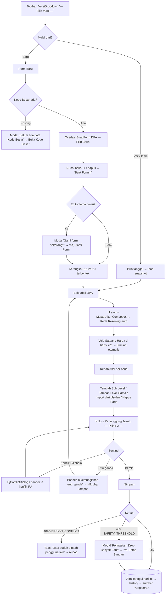
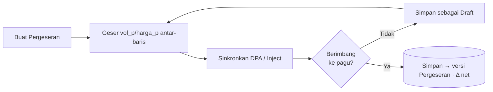

# TUTORIAL & ALUR APLIKASI BLUD — PRIMA
> RSJD Dr. Amino Gondohutomo · Modul **BLUD** (`/blud`)
> Panduan A–Z dari login sampai output cetak. Nama tombol di bawah **persis** seperti di aplikasi.

**Akses**: `SUPER_ADMIN` / `ADMIN` (`isBludRole`), atau role lain yang diberi `app_access: 'blud'` lewat Admin Panel.

---

## 1. Peta Modul (8 menu, 5 grup)

| Grup | Menu | URL | Fungsi singkat |
|---|---|---|---|
| **NAVIGASI** | Beranda | `/blud` | Dashboard KPI + riwayat 5 versi terbaru DPA & Pergeseran |
| **DATA INDUK** | Master Akun | `/blud/master-akun` | Daftar akun belanja + kode rekening |
| **DATA INDUK** | Kode Besar | `/blud/kode-besar` | Kerangka standar BLUD (L1→L2→L2.1) — template DPA |
| **DATA INDUK** | Penanggung Jawab | `/blud/penanggung-jawab` | Daftar Kasubbag/Kasi/Kabid untuk kolom PJ di DPA |
| **ANGGARAN** | DPA BLUD | `/blud/dpa` | Susun Dokumen Pelaksanaan Anggaran (pohon L1→L8.1) |
| **ANGGARAN** | Pergeseran DPA | `/blud/pergeseran` | Geser anggaran antar-baris (pagu tetap) |
| **OUTPUT** | Cetak | `/blud/cetak` | Preview + cetak/ekspor DPA, PJ, Rekap Pergeseran, Master Akun |
| **SISTEM** | Pengaturan | `/blud/pengaturan` | Hapus/kelola versi DPA & Pergeseran (dengan kode konfirmasi) |

> **Urutan pemakaian yang benar**: siapkan **Data Induk dulu** (sekali di awal) → baru **DPA** → **Pergeseran** → **Cetak**. Pengaturan dipakai sesekali untuk pemeliharaan versi.

---

## 2. Flowchart Alur Besar (A–Z)

```mermaid
flowchart TD
    A([Login]) --> B[Menu utama → kartu BLUD] --> C[/blud · Beranda/]

    C --> F0{Data Induk<br/>sudah lengkap?}
    F0 -->|Belum| SETUP
    F0 -->|Sudah| DPA

    subgraph SETUP [FASE 1 · SETUP DATA INDUK · sekali di awal]
        direction TB
        MA[Master Akun<br/>daftar akun + kode rekening] --> KB[Kode Besar<br/>kerangka L1/L2/L2.1] --> PJ[Penanggung Jawab<br/>daftar Kasubbag/Kasi/Kabid]
    end
    SETUP --> DPA

    subgraph DPA [FASE 2 · SUSUN DPA BLUD · /blud/dpa]
        direction TB
        D1[Form Baru → template dari Kode Besar] --> D2[Kurasi baris → Buat Form n]
        D2 --> D3[Isi Uraian via Master Akun → kode auto<br/>Vol/Satuan/Harga di baris leaf]
        D3 --> D4[Tambah Sub Level / Level Sama<br/>atau Import dari Usulan]
        D4 --> D5[Set Penanggung Jawab per baris]
        D5 --> D6{Sentinel<br/>bersih?}
        D6 -->|Konflik PJ / entri ganda| D7[Perbaiki lewat chip banner] --> D5
        D6 -->|Bersih| D8[Simpan]
    end
    DPA --> V{Server cek}
    V -->|409 Versi berubah| VR[Reload] --> DPA
    V -->|Drop baris >50%| VW[Konfirmasi 'Ya, Tetap Simpan']
    V -->|OK| VS[(Versi tanggal hari ini tersimpan)]
    VW --> VS

    VS --> PG
    subgraph PG [FASE 3 · PERGESERAN DPA · /blud/pergeseran]
        direction TB
        P1[Buat Pergeseran → tarik dari versi DPA terbaru] --> P2[Geser vol/harga antar-baris]
        P2 --> P3[Sinkronkan DPA / Inject<br/>refresh kolom kode/uraian dari DPA]
        P3 --> P4{Total berimbang<br/>terhadap pagu?}
        P4 -->|Belum imbang| P5[Simpan sebagai Draft] --> P2
        P4 -->|Imbang| P6[Simpan → versi Pergeseran]
    end
    PG --> OUT

    subgraph OUT [FASE 4 · OUTPUT & PEMELIHARAAN]
        direction TB
        O1[Cetak → pilih Menu + View → Cetak<br/>DPA / PJ / Rekap Pergeseran / Master Akun] --> O2[Ekspor PDF / Excel]
        O3[Pengaturan → hapus/kelola versi<br/>DPA & Pergeseran + kode konfirmasi]
    end
    OUT --> Z([Selesai])
```

---

## 3. FASE 1 — Setup Data Induk

Ketiga menu Data Induk pakai pola tabel yang sama: **tambah baris → edit inline → Simpan**. Bisa juga **impor dari file**. Simpan bersifat *replace-all* (seluruh tabel jadi 1 versi utuh).

### 3.1 Master Akun (`/blud/master-akun`)
| No | Elemen | Aksi | Hasil |
|---|---|---|---|
| 1 | Tombol tambah baris | Klik → baris kosong muncul & fokus | Baris baru siap diisi |
| 2 | Kolom **Kode** & **Uraian** | Ketik kode rekening + nama akun | Tersimpan di state |
| 3 | Impor file | Pilih file (`handleFile`) | Isi tabel dari file |
| 4 | Ikon hapus baris | Klik | Baris dibuang |
| 5 | **Simpan** | Klik | Semua baris tersimpan (jadi sumber MasterAkunCombobox di DPA) |

> **Kenapa penting**: kolom **Uraian** di DPA mengambil dari sini, dan **Kode Rekening** terisi otomatis (read-only) begitu akun dipilih.

### 3.2 Kode Besar (`/blud/kode-besar`)
Sama seperti Master Akun, **plus** kolom **Level** & **Induk (parent_kode)** dan tombol **geser atas/bawah**.

| No | Elemen | Aksi | Hasil |
|---|---|---|---|
| 1 | Kolom **Level** | Pilih `L1` / `L2` / `L2.1` | Menentukan posisi hierarki |
| 2 | Kolom **Induk** | Pilih kode induk | Membentuk pohon L1→L2→L2.1 |
| 3 | Panah **↑ / ↓** | Geser urutan baris | Atur susunan tampil |
| 4 | **Simpan** | Klik | Jadi **template** saat klik "Form Baru" di DPA |

> Seed awal 8 baris standar BLUD (5.X / 5.1 / 5.2 / 5.1.1 / …) sudah tersedia. Kalau Kode Besar kosong, DPA tidak bisa buat form baru — muncul modal **"Belum ada data Kode Besar"** → tombol **"Buka Kode Besar"**.

### 3.3 Penanggung Jawab (`/blud/penanggung-jawab`)
Tabel 1 kolom **Label** (nama jabatan). Seed 13 default Kasubbag/Kasi/Kabid.

| No | Elemen | Aksi | Hasil |
|---|---|---|---|
| 1 | Tambah baris → isi **Label** | Ketik nama jabatan | Muncul di dropdown PJ DPA |
| 2 | Panah ↑ / ↓ | Atur urutan | Urutan dropdown |
| 3 | **Simpan** | Klik | Jadi opsi `PenanggungJawabCombobox` di DPA |

---

## 4. FASE 2 — Susun DPA BLUD (`/blud/dpa`)

Inti modul. DPA = pohon hierarki **Level 1 → Level 8.1** (chain rule ketat): **baris leaf (✎)** bisa input vol/harga, **baris induk** = agregator otomatis (jumlah induk = Σ anak).

### 4.1 Langkah detail DPA
| No | Tombol/elemen PERSIS | Aksi | Hasil |
|---|---|---|---|
| 1 | **VersiDropdown** "— Pilih Versi —" | Pilih tanggal versi | Load snapshot versi itu (`GET /api/blud/dpa?tanggal=`) |
| 2 | **"Form Baru"** (ungu) / **"Mulai Form DPA Baru"** (empty state) | Klik | Ambil template Kode Besar → overlay pilih baris |
| 3 | Overlay **"Buat Form DPA — Pilih Baris"**: panah ⬆⬇, hapus, footer **"Buat Form (n)"** | Kurasi baris template | Bangun kerangka L1→L2→L2.1 |
| 4 | Kolom **Uraian** = `MasterAkunCombobox` | Ketik/cari akun | Uraian + **Kode Rekening** (read-only) terisi atomik |
| 5 | Kolom **Vol / Satuan / Harga (Rp)** (hanya leaf ✎) | Isi angka | **Jumlah (Rp)** dihitung otomatis; jumlah induk = Σ anak |
| 6 | Kebab **Aksi** (`RowActionsMenu`) | Klik | **Tambah Sub Level** · **Tambah Level Sama** · **Import dari Usulan** · **Hapus Baris** |
| 7 | Modal **"Import dari Usulan Kebutuhan"** | Pilih mode | **"Isi baris ini"** (1 item timpa leaf) / **"Sisip baris baru"** (multi + Panel Susunan ◀▶↑↓) |
| 8 | Kolom **Penanggung Jawab** = `PenanggungJawabCombobox` "— Pilih PJ —" | Pilih PJ | Sentinel PJ cek konflik chain vertikal |
| 9 | Banner Sentinel (merah PJ / amber entri ganda) | Klik chip | Lompat ke baris bermasalah |
| 10 | Search **"Cari kode / uraian…"** + **"Jump"** · chip legenda level | Ketik/klik | Lompat + highlight; filter tampil level |
| 11 | **"Simpan"** (primary) | Klik | POST `/api/blud/dpa` — versi = tanggal hari ini (optimistic lock) |

### 4.2 Peringatan yang mungkin muncul saat Simpan
- **409 VERSION_CONFLICT** → orang lain sudah mengubah data → *reload* dulu.
- **409 SAFETY_THRESHOLD** (baris turun >50%) → modal **"⚠️ Peringatan: Drop Banyak Baris"** → **"Ya, Tetap Simpan"** kalau memang disengaja.
- Hapus baris induk yang punya anak → modal **"Tidak Bisa Menghapus"** → hapus anak-anaknya dulu.

### 4.3 Import dari Usulan (2 mode)
| Mode | Kapan | Perilaku |
|---|---|---|
| **Isi baris ini** (amber) | Anchor = baris leaf tanpa anak | 1 item radio menimpa uraian/vol/satuan/harga; kode rekening & PJ **dipertahankan**; baris berisi → konfirmasi **"Timpa"** |
| **Sisip baris baru** (ungu) | Mau menambah banyak baris | Multi-item → dock **"SUSUNAN (n)"**: ◀ naik level · ▶ turun level · ↑↓ urutan → parent dari susunan; **"Import (n)"** |

> Item yang **sudah ada** di form otomatis di-disable (anti-dobel). Kalau masih kembar, banner **"n kemungkinan entri ganda"** menunjukkannya (Sentinel Guard 3 lapis: modal disable → banner live → server `validateTreeIntegrity` 400).

---

## 5. FASE 3 — Pergeseran DPA (`/blud/pergeseran`)

Menggeser anggaran antar-baris **dengan pagu tetap** (total tidak berubah). Sumber data = versi DPA terbaru.

| No | Tombol PERSIS | Aksi | Hasil |
|---|---|---|---|
| 1 | **"Buat Pergeseran"** | Klik | Tarik struktur dari versi DPA terbaru sebagai basis |
| 2 | Tabel pergeseran (kolom vol_p / harga_p) | Geser angka antar-baris | Δ (delta) per baris dihitung |
| 3 | **"Sinkronkan DPA"** (Inject) | Klik → modal **"Inject DPA"** → **"Ya, Inject"** | Refresh kolom kode/uraian/vol/harga dari DPA terbaru **tanpa** mengubah vol_p/harga_p |
| 4 | **"Simpan"** | Klik | Kalau total **tidak berimbang** → dialog: *"pergeseran final wajib berimbang (pagu tetap)"* → **"Simpan sebagai Draft"** |
| 5 | Modal drop banyak baris | — | **"Ya, Tetap Simpan"** (sama seperti DPA) |

> **Δ Pergeseran Net** yang tampil di Beranda = selisih total pergeseran terhadap DPA. Untuk versi *final* harus **0** (berimbang); yang belum imbang disimpan sebagai **Draft**.

---

## 6. FASE 4 — Output & Pemeliharaan

### 6.1 Cetak (`/blud/cetak`)
| No | Elemen | Aksi | Hasil |
|---|---|---|---|
| 1 | Dropdown **Menu** | Pilih modul (DPA / Pergeseran / Master Akun) | Menentukan sumber |
| 2 | Dropdown **View** | Pilih tampilan: **DPA BLUD**, **PENANGGUNG JAWAB**, **Rekap Pergeseran**, **Master Akun** | Layout cetak |
| 3 | Pilih versi (kalau ada) | — | Snapshot yang dicetak |
| 4 | **Cetak** | Klik | Preview tabel siap cetak |
| 5 | Ekspor | Klik | Unduh **PDF** / **Excel** (`lib/blud/export/`) |

> Empty state: *"Belum ada data. Pilih menu & view, lalu klik **Cetak**."*

### 6.2 Pengaturan (`/blud/pengaturan`)
Kelola/hapus versi DPA & Pergeseran. Hapus destruktif → wajib **ketik kode konfirmasi** yang di-generate.

| No | Elemen | Aksi | Hasil |
|---|---|---|---|
| 1 | Section **Versi DPA** / **Versi Pergeseran** | Lihat daftar versi | Riwayat lengkap |
| 2 | Ikon hapus versi | Klik → modal | Muncul **kode konfirmasi** acak |
| 3 | Ketik kode → konfirmasi | Klik | Versi dihapus (rate-limited `bludRateLimit`) |

---

## 7. Ringkasan "Sekali Jalan" (checklist A–Z)

1. **Login** → **Menu** → kartu **BLUD**.
2. **Master Akun** → isi akun + kode rekening → **Simpan**.
3. **Kode Besar** → susun kerangka L1/L2/L2.1 → **Simpan**.
4. **Penanggung Jawab** → isi daftar jabatan → **Simpan**.
5. **DPA BLUD** → **Form Baru** → **Buat Form (n)** → isi Uraian/Vol/Harga → set **PJ** → beres Sentinel → **Simpan** (jadi versi tanggal ini).
6. *(opsional)* **Import dari Usulan** untuk menarik item usulan final.
7. **Pergeseran DPA** → **Buat Pergeseran** → geser → **Sinkronkan DPA** → **Simpan** (imbang) / **Draft** (belum imbang).
8. **Cetak** → pilih Menu + View → **Cetak** → ekspor **PDF/Excel**.
9. **Pengaturan** → hapus/kelola versi bila perlu.

---

### Referensi kode
- Shell & navigasi: `app/(dashboard)/blud/blud-shell.tsx`
- DPA: `app/(dashboard)/blud/dpa/dpa-client.tsx` · API `app/api/blud/dpa/` · `lib/blud/recalc.ts` · `lib/blud/dup-guard.ts`
- Pergeseran: `app/(dashboard)/blud/pergeseran/pergeseran-client.tsx` · API `app/api/blud/pergeseran/`
- Data Induk: `master-akun/` · `kode-besar/` · `penanggung-jawab/` (client + API senama)
- Cetak: `app/(dashboard)/blud/cetak/cetak-client.tsx` · `lib/blud/export/{pdf,excel}.ts`
- Pengaturan: `app/(dashboard)/blud/pengaturan/pengaturan-client.tsx`
- Workflow sumber: `docs/session/sentinel/workflows/WORKFLOW-blud-dpa.md`
