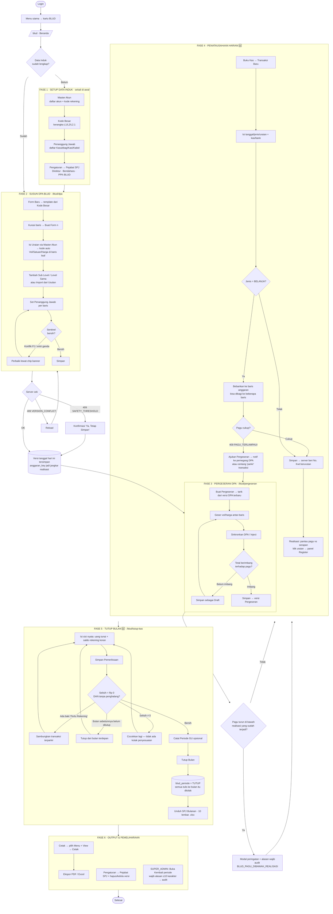
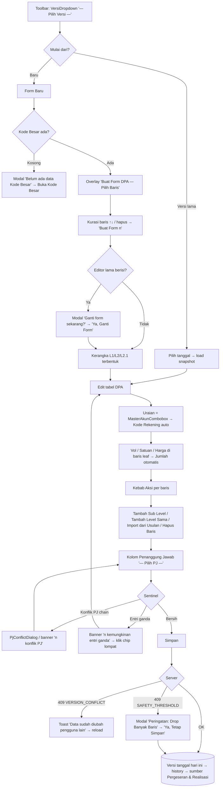
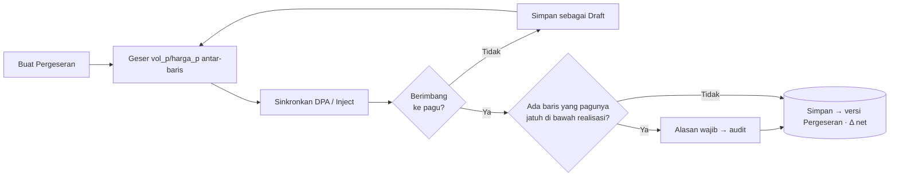
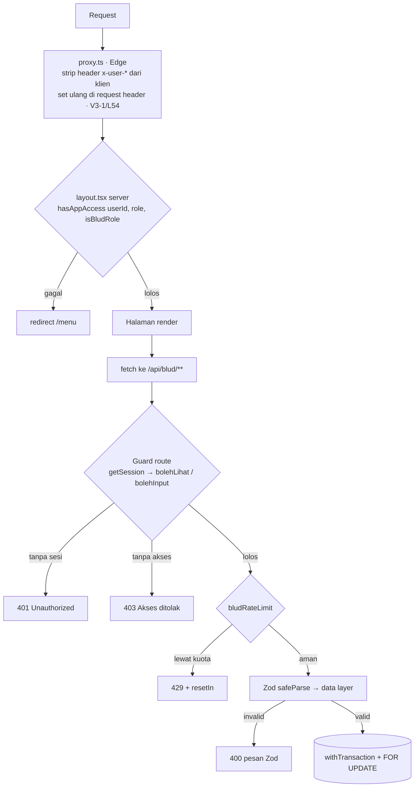

# TUTORIAL & ALUR APLIKASI BLUD — PRIMA
> RSJD Dr. Amino Gondohutomo · Modul **BLUD** (`/blud`)
> Panduan A–Z dari login sampai output cetak & SPJ bulanan. Nama tombol di bawah **persis** seperti di aplikasi.
> Terakhir diperbarui: 2026-07-27 (setelah Fase 5 — Penatausahaan Bendahara Pengeluaran).

**Akses**: `SUPER_ADMIN` / `ADMIN` (`isBludRole`), atau role lain yang diberi `app_access: 'blud'` lewat Admin Panel.
Rincian gerbang akses per-endpoint → [§9 Guard & Keamanan](#9-guard--keamanan-lengkap).

---

## 1. Peta Modul (11 menu, 6 grup)

| Grup | Menu | URL | Fungsi singkat |
|---|---|---|---|
| **NAVIGASI** | Beranda | `/blud` | Dashboard KPI + riwayat 5 versi terbaru DPA & Pergeseran |
| **DATA INDUK** | Master Akun | `/blud/master-akun` | Daftar akun belanja + kode rekening |
| **DATA INDUK** | Kode Besar | `/blud/kode-besar` | Kerangka standar BLUD (L1→L2→L2.1) — template DPA |
| **DATA INDUK** | Penanggung Jawab | `/blud/penanggung-jawab` | Daftar Kasubbag/Kasi/Kabid untuk kolom PJ di DPA |
| **ANGGARAN** | DPA BLUD | `/blud/dpa` | Susun Dokumen Pelaksanaan Anggaran (pohon L1→L8.1) |
| **ANGGARAN** | Pergeseran DPA | `/blud/pergeseran` | Geser anggaran antar-baris (pagu tetap) |
| **PENATAUSAHAAN** 🆕 | Buku Kas | `/blud/buku-kas` | Catat transaksi kas/bank harian (BKU) + pembebanan ke baris anggaran |
| **PENATAUSAHAAN** 🆕 | Realisasi | `/blud/realisasi` | Pantau pagu vs serapan per rekening + register per baris |
| **PENATAUSAHAAN** 🆕 | Tutup Kas | `/blud/tutup-kas` | Berita Acara Pemeriksaan Kas + periode GU + unduh SPJ 10 lembar |
| **OUTPUT** | Cetak | `/blud/cetak` | Preview + cetak/ekspor DPA, PJ, Rekap Pergeseran, Master Akun |
| **SISTEM** | Pengaturan | `/blud/pengaturan` | Pejabat penanda tangan SPJ + hapus/kelola versi DPA & Pergeseran |

> **Ribbon**: tile ke-10 dan seterusnya masuk dropdown **"Lainnya"** (`MAX_INLINE_TILES = 10` di `blud-shell.tsx`). Saat ini **Cetak** & **Pengaturan** ada di sana. Tile yang sedang aktif selalu dipromosikan ke ribbon walau posisinya di overflow.

> **Urutan pemakaian yang benar**: **Data Induk** (sekali di awal) → **DPA** → **Pergeseran** → **Buku Kas** (harian) → **Realisasi** (pantau) → **Tutup Kas** (akhir bulan) → **Cetak / SPJ**.

---

## 2. Flowchart Alur Besar (A–Z)


```mermaid
flowchart TD
    A([Login]) --> B[Menu utama → kartu BLUD] --> C[/blud · Beranda/]

    C --> F0{Data Induk<br/>sudah lengkap?}
    F0 -->|Belum| SETUP
    F0 -->|Sudah| DPA

    subgraph SETUP [FASE 1 · SETUP DATA INDUK · sekali di awal]
        direction TB
        MA[Master Akun<br/>daftar akun + kode rekening] --> KB[Kode Besar<br/>kerangka L1/L2/L2.1] --> PJ[Penanggung Jawab<br/>daftar Kasubbag/Kasi/Kabid]
        PJ --> PS[Pengaturan → Pejabat SPJ<br/>Direktur · Bendahara · PPK-BLUD]
    end
    SETUP --> DPA

    subgraph DPA [FASE 2 · SUSUN DPA BLUD · /blud/dpa]
        direction TB
        D1[Form Baru → template dari Kode Besar] --> D2[Kurasi baris → Buat Form n]
        D2 --> D3[Isi Uraian via Master Akun → kode auto<br/>Vol/Satuan/Harga di baris leaf]
        D3 --> D4[Tambah Sub Level / Level Sama<br/>atau Import dari Usulan]
        D4 --> D5[Set Penanggung Jawab per baris]
        D5 --> D6{Sentinel<br/>bersih?}
        D6 -->|Konflik PJ / entri ganda| D7[Perbaiki lewat chip banner] --> D5
        D6 -->|Bersih| D8[Simpan]
    end
    DPA --> V{Server cek}
    V -->|409 VERSION_CONFLICT| VR[Reload] --> DPA
    V -->|409 SAFETY_THRESHOLD| VW[Konfirmasi 'Ya, Tetap Simpan']
    V -->|OK| VS[(Versi tanggal hari ini tersimpan<br/>anggaran_key jadi jangkar realisasi)]
    VW --> VS

    VS --> PG
    subgraph PG [FASE 3 · PERGESERAN DPA · /blud/pergeseran]
        direction TB
        P1[Buat Pergeseran → tarik dari versi DPA terbaru] --> P2[Geser vol/harga antar-baris]
        P2 --> P3[Sinkronkan DPA / Inject]
        P3 --> P4{Total berimbang<br/>terhadap pagu?}
        P4 -->|Belum imbang| P5[Simpan sebagai Draft] --> P2
        P4 -->|Imbang| P6[Simpan → versi Pergeseran]
    end
    PG --> PGC{Pagu turun di bawah<br/>realisasi yang sudah terjadi?}
    PGC -->|Ya| PGD[Modal peringatan + alasan wajib<br/>audit BLUD_PAGU_DIBAWAH_REALISASI]
    PGC -->|Tidak| PEN
    PGD --> PEN

    subgraph PEN [FASE 4 · PENATAUSAHAAN HARIAN 🆕]
        direction TB
        K1[Buku Kas → Transaksi Baru] --> K2[Isi tanggal/jenis/uraian + kas/bank]
        K2 --> K3{Jenis = BELANJA?}
        K3 -->|Ya| K4[Bebankan ke baris anggaran<br/>bisa dibagi ke beberapa baris]
        K3 -->|Tidak| K7
        K4 --> K5{Pagu cukup?}
        K5 -->|409 PAGU_TERLAMPAUI| K6[Ajukan Pergeseran → notif ke pemegang DPA<br/>atau centang 'parkir' transaksi]
        K6 --> PG
        K5 -->|Cukup| K7[Simpan → server beri No. Kwt berurutan]
        K7 --> K8[Realisasi: pantau pagu vs serapan<br/>klik uraian → panel Register]
    end
    PEN --> TUT

    subgraph TUT [FASE 5 · TUTUP BULAN 🆕 · /blud/tutup-kas]
        direction TB
        T1[Isi sisi nyata: uang tunai + saldo rekening koran] --> T2[Simpan Pemeriksaan]
        T2 --> T3{Selisih = Rp 0<br/>DAN tanpa penghalang?}
        T3 -->|Ada baki 'Perlu Rekening'| T4[Sambungkan transaksi terparkir] --> T1
        T3 -->|Bulan sebelumnya belum ditutup| T5[Tutup dari bulan terdepan] --> T1
        T3 -->|Selisih ≠ 0| T6[Cocokkan lagi — tidak ada kotak penyesuaian] --> T1
        T3 -->|Bersih| T7[Catat Periode GU opsional] --> T8[Tutup Bulan]
        T8 --> T9[(blud_periode = TUTUP<br/>semua tulis ke bulan itu ditolak)]
        T9 --> T10[Unduh SPJ Bulanan · 10 lembar .xlsx]
    end
    TUT --> OUT

    subgraph OUT [FASE 6 · OUTPUT & PEMELIHARAAN]
        direction TB
        O1[Cetak → pilih Menu + View → Cetak] --> O2[Ekspor PDF / Excel]
        O3[Pengaturan → Pejabat SPJ + hapus/kelola versi]
        O4[SUPER_ADMIN: Buka Kembali periode<br/>wajib alasan ≥10 karakter → audit]
    end
    OUT --> Z([Selesai])
```

---

## 3. FASE 1 — Setup Data Induk

Ketiga menu Data Induk pakai pola tabel yang sama: **tambah baris → edit inline → Simpan**. Bisa juga **impor dari file**. Simpan bersifat *replace-all* (seluruh tabel jadi 1 versi utuh).

### 3.1 Master Akun (`/blud/master-akun`)
| No | Elemen | Aksi | Hasil |
|---|---|---|---|
| 1 | Tombol tambah baris | Klik → baris kosong muncul & fokus | Baris baru siap diisi |
| 2 | Kolom **Kode** & **Uraian** | Ketik kode rekening + nama akun | Tersimpan di state |
| 3 | Impor file | Pilih file (`handleFile`) | Isi tabel dari file |
| 4 | Ikon hapus baris | Klik | Baris dibuang |
| 5 | **Simpan** | Klik | Semua baris tersimpan (jadi sumber MasterAkunCombobox di DPA) |

> **Kenapa penting**: kolom **Uraian** di DPA mengambil dari sini, dan **Kode Rekening** terisi otomatis (read-only) begitu akun dipilih.

### 3.2 Kode Besar (`/blud/kode-besar`)
Sama seperti Master Akun, **plus** kolom **Level** & **Induk (parent_kode)** dan tombol **geser atas/bawah**.

| No | Elemen | Aksi | Hasil |
|---|---|---|---|
| 1 | Kolom **Level** | Pilih `L1` / `L2` / `L2.1` | Menentukan posisi hierarki |
| 2 | Kolom **Induk** | Pilih kode induk | Membentuk pohon L1→L2→L2.1 |
| 3 | Panah **↑ / ↓** | Geser urutan baris | Atur susunan tampil |
| 4 | **Simpan** | Klik | Jadi **template** saat klik "Form Baru" di DPA |

> Seed awal 8 baris standar BLUD (5.X / 5.1 / 5.2 / 5.1.1 / …) sudah tersedia. Kalau Kode Besar kosong, DPA tidak bisa buat form baru — muncul modal **"Belum ada data Kode Besar"** → tombol **"Buka Kode Besar"**.

### 3.3 Penanggung Jawab (`/blud/penanggung-jawab`)
Tabel 1 kolom **Label** (nama jabatan). Seed 13 default Kasubbag/Kasi/Kabid.

| No | Elemen | Aksi | Hasil |
|---|---|---|---|
| 1 | Tambah baris → isi **Label** | Ketik nama jabatan | Muncul di dropdown PJ DPA |
| 2 | Panah ↑ / ↓ | Atur urutan | Urutan dropdown |
| 3 | **Simpan** | Klik | Jadi opsi `PenanggungJawabCombobox` di DPA |

### 3.4 Pejabat Penanda Tangan SPJ (`/blud/pengaturan` → panel atas) 🆕
Tiga peran yang tanda tangannya muncul di lembar SPJ, pengantar, dan Tutup Kas: **Direktur**, **Bendahara Pengeluaran**, **PPK-BLUD** — disimpan **per tahun anggaran**.

| No | Elemen | Aksi | Hasil |
|---|---|---|---|
| 1 | **"Ambil dari PK"** | Klik | Saran nama/NIP/pangkat dari master `pk_pejabat` tahun tsb |
| 2 | Kolom Nama / NIP / Pangkat / Jabatan (teks) | Ketik atau perbaiki | Isian bebas — bisa berbeda dari PK |
| 3 | **Simpan** | Klik | Replace-all per tahun · audit `BLUD_PEJABAT_SIMPAN` |

> **Keputusan #29 — yang disimpan SALINAN, bukan rujukan.** Jalur cetak tidak pernah JOIN ke `pk_pejabat`, supaya SPJ yang sudah ditandatangani tidak ikut berubah saat master PK diperbarui tahun berikutnya. `pk_pejabat_id` hanya jejak asal.
> Bendahara Pengeluaran & PPK-BLUD memang **tidak ada** di `pk_pejabat` (itu hanya jabatan struktural), jadi bunyi jabatannya diketik manual.

---

## 4. FASE 2 — Susun DPA BLUD (`/blud/dpa`)

Inti modul. DPA = pohon hierarki **Level 1 → Level 8.1** (chain rule ketat): **baris leaf (✎)** bisa input vol/harga, **baris induk** = agregator otomatis (jumlah induk = Σ anak).


```mermaid
flowchart TD
    S1[Toolbar: VersiDropdown '— Pilih Versi —'] --> S2{Mulai dari?}
    S2 -->|Versi lama| S3[Pilih tanggal → load snapshot]
    S2 -->|Baru| S4[Form Baru]
    S4 --> S5{Kode Besar ada?}
    S5 -->|Kosong| S6[Modal 'Belum ada data Kode Besar' → Buka Kode Besar]
    S5 -->|Ada| S7[Overlay 'Buat Form DPA — Pilih Baris']
    S7 --> S8[Kurasi baris ↑↓ / hapus → 'Buat Form n']
    S8 --> S9{Editor lama berisi?}
    S9 -->|Ya| S10[Modal 'Ganti form sekarang?' → 'Ya, Ganti Form']
    S9 -->|Tidak| S11[Kerangka L1/L2/L2.1 terbentuk]
    S10 --> S11
    S3 --> EDIT
    S11 --> EDIT[Edit tabel DPA]
    EDIT --> E1[Uraian = MasterAkunCombobox → Kode Rekening auto]
    E1 --> E2[Vol / Satuan / Harga di baris leaf → Jumlah otomatis]
    E2 --> E3[Kebab Aksi per baris]
    E3 --> E4[Tambah Sub Level / Tambah Level Sama / Import dari Usulan / Hapus Baris]
    E4 --> E5[Kolom Penanggung Jawab '— Pilih PJ —']
    E5 --> E6{Sentinel}
    E6 -->|Konflik PJ chain| E7[PjConflictDialog / banner 'n konflik PJ']
    E6 -->|Entri ganda| E8[Banner 'n kemungkinan entri ganda' → klik chip lompat]
    E6 -->|Bersih| E9[Simpan]
    E7 --> E5
    E8 --> EDIT
    E9 --> CK{Server}
    CK -->|409 VERSION_CONFLICT| R1[Toast 'Data sudah diubah pengguna lain' → reload]
    CK -->|409 SAFETY_THRESHOLD| R2[Modal 'Peringatan: Drop Banyak Baris' → 'Ya, Tetap Simpan']
    CK -->|OK| R3[(Versi tanggal hari ini → history → sumber Pergeseran & Realisasi)]
    R2 --> R3
```

### 4.1 Langkah detail DPA
| No | Tombol/elemen PERSIS | Aksi | Hasil |
|---|---|---|---|
| 1 | **VersiDropdown** "— Pilih Versi —" | Pilih tanggal versi | Load snapshot versi itu (`GET /api/blud/dpa?tanggal=`) |
| 2 | **"Form Baru"** (ungu) / **"Mulai Form DPA Baru"** (empty state) | Klik | Ambil template Kode Besar → overlay pilih baris |
| 3 | Overlay **"Buat Form DPA — Pilih Baris"**: panah ⬆⬇, hapus, footer **"Buat Form (n)"** | Kurasi baris template | Bangun kerangka L1→L2→L2.1 |
| 4 | Kolom **Uraian** = `MasterAkunCombobox` | Ketik/cari akun | Uraian + **Kode Rekening** (read-only) terisi atomik |
| 5 | Kolom **Vol / Satuan / Harga (Rp)** (hanya leaf ✎) | Isi angka | **Jumlah (Rp)** dihitung otomatis; jumlah induk = Σ anak |
| 6 | Kebab **Aksi** (`RowActionsMenu`) | Klik | **Tambah Sub Level** · **Tambah Level Sama** · **Import dari Usulan** · **Hapus Baris** |
| 7 | Modal **"Import dari Usulan Kebutuhan"** | Pilih mode | **"Isi baris ini"** (1 item timpa leaf) / **"Sisip baris baru"** (multi + Panel Susunan ◀▶↑↓) |
| 8 | Kolom **Penanggung Jawab** = `PenanggungJawabCombobox` "— Pilih PJ —" | Pilih PJ | Sentinel PJ cek konflik chain vertikal |
| 9 | Banner Sentinel (merah PJ / amber entri ganda) | Klik chip | Lompat ke baris bermasalah |
| 10 | Search **"Cari kode / uraian…"** + **"Jump"** · chip legenda level | Ketik/klik | Lompat + highlight; filter tampil level |
| 11 | **"Simpan"** (primary) | Klik | POST `/api/blud/dpa` — versi = tanggal hari ini (optimistic lock) |

### 4.2 Peringatan yang mungkin muncul saat Simpan
- **409 VERSION_CONFLICT** → orang lain sudah mengubah data → *reload* dulu.
- **409 SAFETY_THRESHOLD** (baris turun >50%) → modal **"⚠️ Peringatan: Drop Banyak Baris"** → **"Ya, Tetap Simpan"** kalau memang disengaja.
- Hapus baris induk yang punya anak → modal **"Tidak Bisa Menghapus"** → hapus anak-anaknya dulu.

### 4.3 `anggaran_key` — jangkar yang menyambung DPA ke realisasi 🆕
Tiap baris DPA punya `anggaran_key` (`AK-` + uuid) yang **tetap sama** lintas versi DPA maupun Pergeseran. Itulah yang dipakai transaksi Buku Kas untuk menunjuk baris anggaran.

Akibatnya yang perlu diketahui pengguna:
- Mengganti uraian/kode rekening sebuah baris **tidak memutus** realisasi yang sudah menempel.
- **Menghapus** baris yang sudah punya realisasi = memutus jangkarnya → di Realisasi baris itu muncul sebagai **yatim**, dan Pergeseran menolaknya lewat §4.3 (lihat [§6.3](#63-pagar-pagu-di-bawah-realisasi-43)).

### 4.4 Import dari Usulan (2 mode)
| Mode | Kapan | Perilaku |
|---|---|---|
| **Isi baris ini** (amber) | Anchor = baris leaf tanpa anak | 1 item radio menimpa uraian/vol/satuan/harga; kode rekening & PJ **dipertahankan**; baris berisi → konfirmasi **"Timpa"** |
| **Sisip baris baru** (ungu) | Mau menambah banyak baris | Multi-item → dock **"SUSUNAN (n)"**: ◀ naik level · ▶ turun level · ↑↓ urutan → parent dari susunan; **"Import (n)"** |

> Item yang **sudah ada** di form otomatis di-disable (anti-dobel). Kalau masih kembar, banner **"n kemungkinan entri ganda"** menunjukkannya (Sentinel Guard 3 lapis: modal disable → banner live → server `validateTreeIntegrity` 400).

---

## 5. FASE 3 — Pergeseran DPA (`/blud/pergeseran`)

Menggeser anggaran antar-baris **dengan pagu tetap** (total tidak berubah). Sumber data = versi DPA terbaru.

| No | Tombol PERSIS | Aksi | Hasil |
|---|---|---|---|
| 1 | **"Buat Pergeseran"** | Klik | Tarik struktur dari versi DPA terbaru sebagai basis |
| 2 | Tabel pergeseran (kolom vol_p / harga_p) | Geser angka antar-baris | Δ (delta) per baris dihitung |
| 3 | **"Sinkronkan DPA"** (Inject) | Klik → modal **"Inject DPA"** → **"Ya, Inject"** | Refresh kolom kode/uraian/vol/harga dari DPA terbaru **tanpa** mengubah vol_p/harga_p · audit `BLUD_INJECT_DPA` |
| 4 | **"Simpan"** | Klik | Kalau total **tidak berimbang** → dialog: *"pergeseran final wajib berimbang (pagu tetap)"* → **"Simpan sebagai Draft"** |
| 5 | Modal drop banyak baris | — | **"Ya, Tetap Simpan"** (sama seperti DPA) |
| 6 | Modal **pagu di bawah realisasi** 🆕 | Isi alasan → lanjut | Audit `BLUD_PAGU_DIBAWAH_REALISASI` (lihat §6.3) |


```mermaid
flowchart LR
    A[Buat Pergeseran] --> B[Geser vol_p/harga_p antar-baris]
    B --> C[Sinkronkan DPA / Inject]
    C --> D{Berimbang<br/>ke pagu?}
    D -->|Tidak| E[Simpan sebagai Draft] --> B
    D -->|Ya| F{Ada baris yang pagunya<br/>jatuh di bawah realisasi?}
    F -->|Ya| G[Alasan wajib → audit] --> H
    F -->|Tidak| H[(Simpan → versi Pergeseran · Δ net)]
```

> **Δ Pergeseran Net** yang tampil di Beranda = selisih total pergeseran terhadap DPA. Untuk versi *final* harus **0** (berimbang); yang belum imbang disimpan sebagai **Draft**.

> 🆕 **Begitu satu versi Pergeseran tersimpan, seluruh pagu tahun itu dibaca dari `pergeseran_dpa`** — DPA tidak dibaca lagi (`getPaguSumber` memeriksa Pergeseran lebih dulu). Karena Pergeseran disimpan *replace-all* (satu versi memuat semua baris), tidak ada baris yang hilang. Pil di layar Buku Kas & Realisasi ikut berubah jadi **"Pagu dari Pergeseran ‹tanggal›"**.

---

## 6. FASE 4 — Penatausahaan Harian 🆕

Tiga menu ini menggantikan berkas Excel BKU. **Satu-satunya titik input adalah Buku Kas**; Realisasi, register, pengantar, SPJ, dan Tutup Kas semuanya **turunan** — tidak ada ketik ulang di mana pun.

### 6.1 Buku Kas (`/blud/buku-kas`) — satu-satunya tempat mengetik

Toolbar: **TahunDropdown** · **dropdown bulan** · pil **"Pagu dari DPA/Pergeseran ‹tanggal›"** · pil **"Periode ditutup"** (kalau terkunci) · tombol **"Transaksi Baru"** (ungu).

Tabel BKU: `No · Tanggal · Kwt · Uraian · Rekening · Kas Masuk · Kas Keluar · Saldo Kas · Bank Masuk · Bank Keluar · Saldo Bank · Aksi`, ditutup baris **JUMLAH BULAN INI**.

#### Modal "Transaksi Baru"
| No | Elemen PERSIS | Aturan |
|---|---|---|
| 1 | **Tanggal** | `YYYY-MM-DD`, wajib |
| 2 | **Jenis** (`OpsiDropdown`) | `BELANJA` · `AMBIL_BANK` · `SETOR_BANK` · `PENERIMAAN` · `LAIN` |
| 3 | **Uraian** | 1–2000 karakter, wajib |
| 4 | **Kas keluar / Bank keluar / Kas masuk / Bank masuk** | Minimal salah satu > 0. Kas masuk **dan** kas keluar bersamaan → ditolak (idem bank). `AMBIL_BANK`/`SETOR_BANK` wajib **netral**: nilai masuk = nilai keluar |
| 5 | Centang **"Rekeningnya belum ada di DPA — parkir transaksi ini"** | Muncul untuk **semua** jenis yang mengeluarkan uang. Transaksi masuk baki "Perlu Rekening"; **tidak boleh punya alokasi** |
| 6 | Dock **"PEMBEBANAN KE BARIS ANGGARAN"** → **"Pilih Rekening"** / **"Bagi ke Baris Lain"** | Satu kuitansi boleh dibebankan ke beberapa baris (kasus Belanja Modal). Maks 200 alokasi; satu baris tidak boleh muncul dua kali |
| 7 | Baris indikator **"Belanja Rp … · dialokasikan Rp … · pas / selisih Rp …"** | Total alokasi **wajib sama** dengan (kas keluar + bank keluar) |
| 8 | **Batal** / **Simpan** | Simpan → `POST /api/blud/realisasi/tx` |

> **No. Kwt tidak diketik.** Nomor kuitansi diberikan **server** berurutan per (tahun, bulan) dan hanya untuk jenis `BELANJA` — supaya dua penginput tidak pernah mendapat nomor yang sama (§5.4).

#### Aturan tunggal: uang keluar wajib punya rekening
| Keadaan | Wajib dibebankan? |
|---|---|
| Arus keluar jenis apa pun (`BELANJA`, `LAIN`, `PENERIMAAN`, …) | **Ya** |
| `AMBIL_BANK` / `SETOR_BANK` yang **netral** (masuk = keluar) | Tidak — cuma pindah tempat |
| `AMBIL_BANK` / `SETOR_BANK` yang **timpang** | **Ya** — itu bukan pemindahan, jenisnya salah pilih |
| Transaksi **diparkir** | Tidak — tapi memblokir Tutup Kas sampai dibereskan |
| Arus murni masuk | Tidak |

> **Kenapa tidak cukup "hanya BELANJA yang dicek"** — itu bentuk lamanya, dan bocor: satu transaksi `LAIN` dengan kas keluar besar dan alokasi kosong lolos seluruh pagar pagu, tersimpan berstatus `NORMAL` (jadi **tidak** menghalangi Tutup Kas seperti transaksi terparkir), dan tidak pernah muncul di layar Realisasi. Uang keluar yang tidak membebani anggaran mana pun.
> Aturannya sekarang hidup di satu berkas — `lib/blud/alokasi-rule.ts` — dan dipakai **bersama** oleh Zod, data layer, serta modal Buku Kas, supaya ketiganya tidak bisa berbeda pendapat. Regresi: `node scripts/test-blud-alokasi.mjs`.

#### Kalau pagu tidak cukup → 409 `PAGU_TERLAMPAUI`
Muncul panel jalan keluar:
- Tombol **"Ajukan Pergeseran"** → membuat permintaan + **notifikasi ke `__ADMIN__`** (semua ADMIN + SUPER_ADMIN) berisi tautan langsung ke menu Pergeseran tahun tsb. Audit `BLUD_PERMINTAAN_CREATE`.
- Atau centang **parkir** supaya saldo kas tetap benar sambil menunggu.

> **Sistem tidak pernah menaikkan pagu sendiri (§4.1).** Ia hanya mengantar permintaan; angkanya tetap ditentukan manusia di menu Pergeseran.

#### Baki "Perlu Rekening"
Banner **"n transaksi diparkir"** + tombol **"Buka Baki"**. Bakinya melihat **satu tahun penuh**, bukan bulan berjalan — transaksi yang diparkir di Mei tetap memblokir Tutup Kas di Juli. Dari baki: klik → modal terbuka dengan transaksi itu, tinggal dipilih rekeningnya dan centang parkir dilepas.

### 6.2 Realisasi (`/blud/realisasi`) — layar pantau, read-only

Kolom: `Kode Rekening · Uraian · Pagu · ‹Bulan› · s.d. Bln Lalu · s.d. ‹Bulan› · Sisa s.d. ‹Bulan› · %`.

| Elemen | Fungsi |
|---|---|
| **"Buka semua"** / **"Ciutkan"** | Buka/tutup seluruh cabang pohon |
| **"Cari kode / uraian…"** | Saring baris |
| Klik **uraian** baris | Buka **panel Register** — daftar transaksi yang membebani baris itu + saldo anggaran berjalan |
| Chip ▲ / ▼ / ➕ di kolom Pagu | Pagu baris ini naik / turun / rekening baru pada versi pergeseran terbaru (tooltip menyebut nilai lama) |
| Baris merah | Sisa minus — terserap melebihi pagu |

**Semua angka dihitung saat dibaca, tidak pernah disimpan.** Serapan hanya menempel di baris terbawah lalu **digulung ke seluruh leluhur** (`gulungKeAtas`) — kalau tidak, baris induk akan tampil nol dan total Realisasi tidak akan pernah cocok dengan Buku Kas.

Peringatan yang bisa muncul:
- **Banner "Pagu diperbarui"** — pergeseran baru tersimpan orang lain (deteksi 3 lapis §4.4, lapis ke-3 memeriksa *sidik jari* pagu tiap 30 detik lewat `?mode=cap`; **bukan** SUM pagu, sebab pergeseran yang berimbang membuat total tetap sama walau tiap barisnya berubah).
- **Peringatan "Tabel ini menunjukkan keadaan sampai ‹Bulan› saja"** — ada realisasi di bulan sesudahnya, jadi sisa yang benar-benar masih bisa dibelanjakan hari ini ditampilkan terpisah.

### 6.3 Pagar "pagu di bawah realisasi" (§4.3)

Arah kebalikan dari §4.1, dan **belum pernah dijaga di Excel**: Pergeseran tidak boleh menurunkan pagu suatu baris di bawah realisasi yang **sudah terjadi**, dan tidak boleh menghapus baris yang masih dipakai transaksi (barisnya jadi yatim). Kalau tetap dilakukan → alasan wajib + audit `BLUD_PAGU_DIBAWAH_REALISASI`.

---

## 7. FASE 5 — Tutup Kas & SPJ 🆕 (`/blud/tutup-kas`)

### 7.1 Dua sisi yang wajib bertemu (§4.7)

```
SISI A  menurut buku   = saldo awal + Σ penerimaan − Σ pengeluaran   ← DIHITUNG, tidak bisa diketik
SISI B  menurut nyata  = uang tunai di brankas + saldo rekening koran ← DIKETIK, dua angka
```

**Selisih harus Rp 0.** Tidak ada kotak "penyesuaian" bebas — itu persis cara berkas Juni 2026 jadi tidak seimbang tanpa ada yang tahu (A = −650.471.561 vs B = 4.883.802.451).

> **Pemindahan bank↔kas dibersihkan (keputusan #32).** Mengambil Rp 440 juta dari bank ke brankas bukan penerimaan — uang sendiri pindah tempat. Rumusnya `SUM(GREATEST((kas_masuk + bank_masuk) − (kas_keluar + bank_keluar), 0))` per transaksi, jadi transaksi pemindahan hasilnya nol di kedua kolom tanpa perlu menebak dari kolom `jenis`. Saldo akhirnya sama saja; yang berbeda kejujuran dua angka yang ditandatangani.

### 7.2 Layar & tombol
| No | Elemen PERSIS | Fungsi |
|---|---|---|
| 1 | Kartu **"Menurut buku"** (*dihitung dari transaksi — tidak bisa diketik*) | Saldo awal kas & bank · Penerimaan bulan ini (+) · Pengeluaran bulan ini (−) · **Saldo akhir menurut buku** |
| 2 | Kartu sisi nyata: **"Uang tunai di brankas"** + **"Saldo rekening koran"** | Dua angka satu-satunya yang diketik → **Saldo akhir menurut kenyataan** |
| 3 | Pita hasil | **"Seimbang — selisih Rp 0. Bulan boleh ditutup."** atau selisihnya |
| 4 | **Nomor surat** (mis. `900/BA-001/2026`) + **Tanggal surat** | Kelengkapan berita acara |
| 5 | **"Simpan Pemeriksaan"** (ghost) | Simpan sisi B **tanpa** menutup — supaya bisa menghitung uang bertahap sambil melihat selisih |
| 6 | **"Tutup Bulan"** (hijau) | Aktif hanya kalau selisih Rp 0 **dan** tanpa penghalang · audit `BLUD_PERIODE_TUTUP` |
| 7 | **"Unduh SPJ Bulanan"** (hijau) | Unduh `.xlsx` 10 lembar · audit `BLUD_SPJ_UNDUH` |
| 8 | **"Buka Kembali"** (amber) | **SUPER_ADMIN saja**, alasan ≥10 karakter · audit `BLUD_PERIODE_BUKA` |

### 7.3 Penghalang tutup — daftarnya satu, dipakai layar **dan** server
`kumpulkanPenghalang()` adalah sumber tunggalnya; UI tidak punya versi aturannya sendiri.

| Penghalang | Pesan | Cara membereskan |
|---|---|---|
| Transaksi diparkir | *"n transaksi masih diparkir di baki 'Perlu Rekening'…"* | Tambah rekeningnya lewat Pergeseran → sambungkan dari baki di Buku Kas |
| Bulan sebelumnya masih terbuka | *"Bulan 3, 4 belum ditutup — saldo awal bulan ini masih bisa berubah. Tutup dari bulan terdepan."* | Tutup berurutan dari bulan terdepan |

> **Kenapa harus berurutan (§4.6)**: saldo awal Januari diisi manual sekali; bulan berikutnya **diturunkan** dari arus kas bulan-bulan sebelumnya — tidak disimpan. Menutup Juni sementara Mei masih terbuka = menandatangani saldo yang masih bisa berubah esok hari. Sebaliknya, koreksi transaksi bulan lalu otomatis merambat ke seluruh bulan sesudahnya.

### 7.4 Periode GU (Ganti Uang Persediaan) — §3.2 / keputusan #31
Satu bulan boleh punya beberapa pengajuan GU (berkas asli: `GU 1-26 Juni 2026`, bukan sebulan penuh). Rentangnya **tidak bisa diterka** dari transaksi — tidak ada penanda "GU ke-2 mulai di sini" di data mana pun — jadi dicatat manual. Yang dicatat **hanya rentangnya**; angka realisasinya tetap dihitung saat lembar dibuat.

| Elemen | Aturan |
|---|---|
| **"Tambah Rentang"** → **Dari** / **Sampai** / **Nomor pengajuan** (opsional) | Maks 10 pengajuan per bulan |
| **"Simpan Periode GU"** | Replace-all per bulan · audit `BLUD_GU_SIMPAN` |
| Validasi | Rentang wajib **di dalam bulan** yang dipilih; **tidak boleh saling tindih** (dua GU beririsan = belanja yang sama diajukan penggantiannya dua kali); `urutan` ditentukan server dari tanggal mulai, bukan dari klien |
| Dikosongkan | Berkas SPJ tetap dapat satu lembar GU untuk sebulan penuh |

### 7.5 Isi berkas SPJ (`SPJ-BLUD-‹Bulan›-‹Tahun›.xlsx`)
Dirakit di **server** (`buatWorkbookSpj`), bukan di browser.

| # | Lembar | Isi |
|---|---|---|
| 1 | ` Realisasi BP` | Pagu vs realisasi bulan berjalan per rekening |
| 2 | `BKU` | Buku Kas Umum bulan itu |
| 3 | `SPI` | Varian BKU |
| 4 | `register` | Register per baris anggaran |
| 5.. | `GU ‹awal›-‹akhir›` | **Satu lembar per pengajuan GU** (jumlahnya mengikuti §7.4) |
| n−3 | `pengantar` | Surat pengantar |
| n−2 | `SPJ` | Rekap SPJ |
| n−1 | `TUTUP KAS` | Berita Acara Pemeriksaan Kas |
| n | `setor BPD` | Setoran ke bank |

> **Keputusan #33**: `pengantar` dan `SPJ` memakai **total alokasi** (`ctx.belanja.total`), bukan kas keluar — supaya angka dua lembar itu sama dengan lembar Realisasi BP.
> Total BKU dan total Realisasi BP **wajib sama**; berbeda = ada yang nyangkut.

---

## 8. FASE 6 — Output & Pemeliharaan

### 8.1 Cetak (`/blud/cetak`)
| No | Elemen | Aksi | Hasil |
|---|---|---|---|
| 1 | Dropdown **Menu** | Pilih modul (DPA / Pergeseran / Master Akun) | Menentukan sumber |
| 2 | Dropdown **View** | **DPA BLUD**, **PENANGGUNG JAWAB**, **Rekap Pergeseran**, **Master Akun** | Layout cetak |
| 3 | Pilih versi (kalau ada) | — | Snapshot yang dicetak |
| 4 | **Cetak** | Klik | Preview tabel siap cetak |
| 5 | Ekspor | Klik | Unduh **PDF** / **Excel** (`lib/blud/export/`) |

> Empty state: *"Belum ada data. Pilih menu & view, lalu klik **Cetak**."*
> SPJ bulanan **tidak** ada di sini — tempatnya di Tutup Kas (§7.2 no. 7).

### 8.2 Pengaturan (`/blud/pengaturan`)
Dua bagian: **Pejabat penanda tangan SPJ** (§3.4) dan **pengelolaan versi**.

| No | Elemen | Aksi | Hasil |
|---|---|---|---|
| 1 | Section **Versi DPA** / **Versi Pergeseran** | Lihat daftar versi | Riwayat lengkap |
| 2 | Ikon hapus versi | Klik → modal | Muncul **kode konfirmasi** acak |
| 3 | Ketik kode → konfirmasi | Klik | Versi dihapus · rate-limited · audit `BLUD_DELETE_DPA_VERSI` / `BLUD_DELETE_PERGESERAN_VERSI` |

---

## 9. Guard & Keamanan (lengkap)

### 9.1 Tiga lapis akses


```mermaid
flowchart TD
    R[Request] --> P[proxy.ts · Edge<br/>strip header x-user-* dari klien<br/>set ulang di request header · V3-1/L54]
    P --> L{layout.tsx server<br/>hasAppAccess userId, role, isBludRole}
    L -->|gagal| M[redirect /menu]
    L -->|lolos| U[Halaman render]
    U --> A[fetch ke /api/blud/**]
    A --> G{Guard route<br/>getSession → bolehLihat / bolehInput}
    G -->|tanpa sesi| E401[401 Unauthorized]
    G -->|tanpa akses| E403[403 Akses ditolak]
    G -->|lolos| RL{bludRateLimit}
    RL -->|lewat kuota| E429[429 + resetIn]
    RL -->|aman| Z[Zod safeParse → data layer]
    Z -->|invalid| E400[400 pesan Zod]
    Z -->|valid| DB[(withTransaction + FOR UPDATE)]
```

> **Guard ditaruh di SETIAP route, bukan hanya di UI.** Menyembunyikan tombol bukan keamanan — endpoint tetap bisa dipanggil lewat `curl` (pelajaran V3-1).

### 9.2 Siapa boleh apa
| Fungsi | Aturan |
|---|---|
| `isBludRole(role, appAccess)` | `SUPER_ADMIN` / `ADMIN`, **atau** `users.app_access` memuat `'blud'` |
| `bolehLihat` → `canViewRealisasi` | Saat ini = `isBludRole` |
| `bolehInput` → `canInputRealisasi` | Saat ini = `isBludRole` |
| **Buka kembali periode** (`DELETE /realisasi/periode`) | **`SUPER_ADMIN` saja** — sengaja lebih ketat dari guard modul, + alasan ≥10 karakter |

> Pemisahan **lihat** vs **input** sudah dipasang sejak awal walau isinya sama (§7.4). Saat pembagian role diaktifkan nanti, yang berubah hanya isi **dua fungsi** itu di `lib/blud/realisasi-schemas.ts` — bukan route-nya.
>
> **AUTHZ-02/V5**: BLUD sengaja **tanpa ownership per-record** — semua pemegang akses bisa mengubah semua record. Itu keputusan, bukan IDOR. Konsekuensinya pemberian `app_access: 'blud'` harus konservatif dan direview berkala.

### 9.3 Rate limit per endpoint (`bludRateLimit`, per-user per-menit)
| Aksi | Kuota | Endpoint |
|---|---|---|
| `realisasi-tx` | 60 | POST/PATCH `/realisasi/tx` |
| `realisasi-tx-delete` | 20 | DELETE `/realisasi/tx` |
| `realisasi-periode` | 20 | POST/DELETE `/realisasi/periode` |
| `realisasi-permintaan` | 20 | POST/PATCH `/realisasi/permintaan` |
| `realisasi-gu` | 20 | POST `/realisasi/gu` |
| `blud-pejabat` | 20 | POST `/blud/pejabat` |
| `realisasi-export` | 10 | GET `/realisasi/export` |
| default lain | 30 | — |

Lewat kuota → **429** + `resetIn` (detik).

### 9.4 Kode error yang dilihat pengguna
| HTTP | `code` | Arti | Yang harus dilakukan |
|---|---|---|---|
| 400 | — (pesan Zod) | Isian tidak valid | Perbaiki isian |
| 400 | `ALOKASI_TIDAK_SEIMBANG` | Total alokasi ≠ nilai belanja | Samakan angkanya |
| 401 | — | Belum login / sesi habis | Login ulang |
| 403 | — | Tidak punya akses BLUD | Minta grant di Admin Panel |
| 409 | `PAGU_TERLAMPAUI` | Pagu baris tidak cukup | **Ajukan Pergeseran** atau parkir |
| 409 | `VERSION_CONFLICT` | Transaksi diubah orang lain | Muat ulang versi terbaru |
| 409 | `PERIODE_TUTUP` / `PERIODE_TERTUTUP` | Bulannya sudah ditutup | Minta SUPER_ADMIN membuka |
| 409 | `TANPA_DPA` | Tahun itu belum punya DPA | Susun DPA dulu |
| 409 | `TIDAK_SEIMBANG` | Sisi buku ≠ sisi nyata | Cocokkan lagi — tidak ada penyesuaian bebas |
| 409 | `TERHALANG` | Ada penghalang tutup | Beresi daftar di §7.3 |
| 429 | — | Terlalu banyak permintaan | Tunggu `resetIn` detik |

### 9.5 Integritas data — yang dijaga di dalam transaksi DB
| Jaminan | Cara |
|---|---|
| Tidak ada uang keluar tanpa membebani anggaran | `wajibBeralokasi()` di `lib/blud/alokasi-rule.ts` — satu aturan dipakai Zod, `periksaKeseimbangan`, dan modal Buku Kas. Pengecualian hanya pemindahan bank↔kas yang netral |
| Pagu tidak bisa jebol saat dua orang menyimpan bersamaan | Satu transaksi: cek periode → **kunci pagu per rekening** → `SELECT SUM(...) FOR UPDATE` → tulis. Membaca sisa di JS lalu INSERT = lost update (L55) |
| `FOR UPDATE` pada SUM alokasi **wajib** | `REPEATABLE READ` membuat SELECT biasa membaca snapshot **sebelum** kunci didapat → alokasi orang lain yang baru commit tak terlihat, kunci menang tapi angkanya basi. Terbukti di `scripts/concurrency-test.js` T7b |
| Deadlock 1213 mustahil | Kunci diambil **berurutan menaik** per `anggaran_key`; kunci nomor kuitansi selalu diambil lebih dulu (§5.3/§5.4) |
| Ubah transaksi tidak menolak dirinya sendiri | `abaikanTxId` mengeluarkan alokasi lama milik transaksi itu dari perhitungan |
| Ubah transaksi anti-tabrakan | CAS `expected_version` + `SELECT … FOR UPDATE` (L48) |
| Bulan tertutup benar-benar terkunci | POST/PATCH/DELETE transaksi memeriksa `blud_periode.status` **di dalam** transaksi |
| Sisi A tidak bisa dipalsukan | Server menghitung ulang saldo buku di dalam `withTransaction`; angka sisi A dari klien tidak pernah dipakai |
| Alokasi ikut terhapus | FK `ON DELETE CASCADE` dari `blud_realisasi_tx` |
| Bulk insert | `bulkInsert()` satu round-trip, bukan `for … await INSERT` (PERF-C1) |

### 9.6 Jejak audit (`audit_log`)
`BLUD_SAVE_DPA` · `BLUD_SAVE_PERGESERAN` · `BLUD_INJECT_DPA` · `BLUD_VIEW_DPA` · `BLUD_VIEW_PERGESERAN` · `BLUD_DELETE_DPA_VERSI` · `BLUD_DELETE_PERGESERAN_VERSI` · `BLUD_SAVE_MASTER_AKUN` · `BLUD_SAVE_KODE_BESAR` · `BLUD_SAVE_PENANGGUNG_JAWAB` · `BLUD_SAVE_REKAP_PK` · `BLUD_IMPORT_USULAN_VIEW` · `BLUD_PJ_CHAIN_CONFLICT` · `BLUD_SENTINEL_ACK` · `BLUD_PAGU_DIBAWAH_REALISASI` · **`BLUD_REALISASI_TX_CREATE` / `_UPDATE` / `_DELETE`** · **`BLUD_PERMINTAAN_CREATE` / `_SELESAI` / `_TOLAK`** · **`BLUD_PERIODE_TUTUP` / `BLUD_PERIODE_BUKA`** · **`BLUD_GU_SIMPAN`** · **`BLUD_PEJABAT_SIMPAN`** · **`BLUD_SPJ_UNDUH`**

> Menu Audit khusus BLUD **ditunda** (keputusan #23) — jejaknya tetap lengkap lewat `writeAuditLog`, dibaca dari Admin Panel.

---

## 10. Model Data & Aturan "dihitung, bukan disimpan"

### 10.1 Tabel
| Tabel | Isi | Migration |
|---|---|---|
| `dpa_blud` | Versi DPA (snapshot per `versi_tanggal` × `tahun_anggaran`) | `migration-blud-dpa-pergeseran.sql`, `-019-chain-l7-l8`, `-tahun-anggaran` |
| `pergeseran_dpa` | Versi Pergeseran (kolom `pergeseran` = pagu **sesudah** digeser) | idem |
| `master_akun` · `kode_besar` · `penanggung_jawab` | Data induk | `-025/026`, `-027` |
| `rekap_pk` | Snapshot rekap Penanggung Jawab BLUD | `-024` |
| `blud_locks` | Kunci optimistik/advisory generik (L51) | `-036-blud-locks.sql` |
| **`blud_realisasi_tx`** | Satu baris = satu baris BKU | `migration-blud-realisasi-tx.sql` |
| **`blud_realisasi_alokasi`** | Pembebanan transaksi ke baris anggaran (FK CASCADE) | idem, + `-realisasi-anggaran-key.sql` |
| **`blud_periode`** | Periode bulanan: saldo awal, sisi nyata, status BUKA/TUTUP | idem |
| **`blud_permintaan`** | Permintaan pergeseran / rekening baru dari bendahara | `migration-blud-permintaan.sql` |
| **`blud_gu_periode`** | Rentang pengajuan GU per bulan | `migration-blud-gu-periode.sql` |
| **`blud_pejabat`** | Pejabat penanda tangan SPJ per tahun (salinan) | `migration-blud-pejabat.sql` |

### 10.2 Yang **tidak pernah** disimpan (dihitung saat dibaca)
| Angka | Dihitung dari |
|---|---|
| Pagu efektif | Pergeseran versi terbaru → kalau tidak ada, DPA versi terbaru |
| Terserap / sisa / % | `SUM(blud_realisasi_alokasi.nilai)` + `gulungKeAtas` ke induk |
| Saldo kas & bank berjalan per baris BKU | Saldo awal + akumulasi masuk−keluar urut tanggal, id |
| Saldo awal bulan ≥2 | Saldo awal Januari + arus kas seluruh bulan sebelumnya |
| Saldo buku (sisi A Tutup Kas) | Saldo awal + penerimaan luar − pengeluaran luar |
| Saldo register per baris anggaran | Pagu − akumulasi alokasi urut waktu |
| Nomor GU (`urutan`) | Diurutkan server dari tanggal mulai |

> **Menyalin pagu ke tabel realisasi = basi begitu ada pergeseran** — persis penyakit berkas Excel yang digantikan modul ini.

---

## 11. Ringkasan "Sekali Jalan" (checklist A–Z)

**Sekali di awal tahun**
1. **Login** → **Menu** → kartu **BLUD**.
2. **Master Akun** → isi akun + kode rekening → **Simpan**.
3. **Kode Besar** → susun kerangka L1/L2/L2.1 → **Simpan**.
4. **Penanggung Jawab** → isi daftar jabatan → **Simpan**.
5. **Pengaturan → Pejabat SPJ** → **"Ambil dari PK"** → lengkapi Bendahara & PPK-BLUD → **Simpan**.
6. **DPA BLUD** → **Form Baru** → **Buat Form (n)** → isi Uraian/Vol/Harga → set **PJ** → beres Sentinel → **Simpan**.
7. *(opsional)* **Import dari Usulan** untuk menarik item usulan final.
8. **Tutup Kas** bulan Januari → isi **saldo awal** tahun berjalan.

**Harian**
9. **Buku Kas** → **Transaksi Baru** → isi → bebankan ke baris anggaran → **Simpan**.
10. Pagu kurang? → **"Ajukan Pergeseran"** (notif ke pemegang DPA) atau **parkir**.

**Saat perlu geser anggaran**
11. **Pergeseran DPA** → **Buat Pergeseran** → geser → **Sinkronkan DPA** → **Simpan** (imbang) / **Draft**.
12. Cek layar **Realisasi**: pastikan tidak ada baris merah (sisa minus).

**Akhir bulan**
13. **Buku Kas** → kosongkan baki **"Perlu Rekening"**.
14. **Tutup Kas** → isi uang tunai + saldo rekening koran → **"Simpan Pemeriksaan"** → pastikan **selisih Rp 0**.
15. Catat **Periode GU** (kalau bulan itu lebih dari satu pengajuan) → **"Simpan Periode GU"**.
16. **"Tutup Bulan"** → **"Unduh SPJ Bulanan"**.
17. Salah? → **SUPER_ADMIN** → **"Buka Kembali"** + alasan ≥10 karakter.

**Kapan saja**
18. **Cetak** → pilih Menu + View → **Cetak** → ekspor **PDF/Excel**.
19. **Pengaturan** → hapus/kelola versi bila perlu.

---

## 12. Referensi kode

**Shell & navigasi**
- `app/(dashboard)/blud/blud-shell.tsx` (ribbon 11 tile + overflow "Lainnya") · `layout.tsx` (guard `hasAppAccess`)

**Anggaran**
- DPA: `blud/dpa/dpa-client.tsx` · API `app/api/blud/dpa/` · `lib/blud/recalc.ts` · `lib/blud/dup-guard.ts` · `lib/blud/anggaran-key.ts`
- Pergeseran: `blud/pergeseran/pergeseran-client.tsx` · API `app/api/blud/pergeseran/` (+ `inject/`)
- Data Induk: `master-akun/` · `kode-besar/` · `penanggung-jawab/` (client + API senama)

**Penatausahaan 🆕**
- Buku Kas: `blud/buku-kas/buku-kas-client.tsx` · `components/blud/TransaksiModal.tsx` · `components/blud/BakiRekeningPanel.tsx`
- Realisasi: `blud/realisasi/realisasi-client.tsx` · `components/blud/RegisterPanel.tsx`
- Tutup Kas: `blud/tutup-kas/tutup-kas-client.tsx`
- API: `app/api/blud/realisasi/{tx,pagu,register,periode,permintaan,gu,export}/route.ts` · `_guard.ts`
- Data layer: `lib/blud/realisasi-data.ts` · `pagu.ts` · `tutup-kas.ts` · `permintaan-data.ts` · `gu-data.ts` · `pejabat-data.ts`
- Zod + guard + error domain: `lib/blud/realisasi-schemas.ts` · rate limit & role: `lib/blud/schemas.ts`
- Aturan alokasi (modul daun, dipakai server + klien): `lib/blud/alokasi-rule.ts` · regresi `scripts/test-blud-alokasi.mjs`
- Kunci: `lib/blud/lock.ts` (`acquireBludLock`, `BLUD_PAGU_ENTITY`, `BLUD_KWT_ENTITY`)
- SPJ: `lib/blud/export/spj-excel.ts` (`buatWorkbookSpj`)

**Output & UI bersama**
- Cetak: `blud/cetak/cetak-client.tsx` · `lib/blud/export/{pdf,excel}.ts`
- Pengaturan: `blud/pengaturan/pengaturan-client.tsx` · `components/blud/PejabatSpjPanel.tsx`
- Dropdown: `components/blud/{TahunDropdown,VersiDropdown,OpsiDropdown}.tsx` · format tanggal: `lib/blud/tanggal.ts`

**Dokumen konsep**
- `docs/CONCEPT-blud-realisasi.md` (§2–§7 + daftar 33 keputusan)
- `docs/CONCEPT-blud-tahun-anggaran.md`
- Workflow sumber: `docs/session/sentinel/workflows/WORKFLOW-blud-dpa.md`
