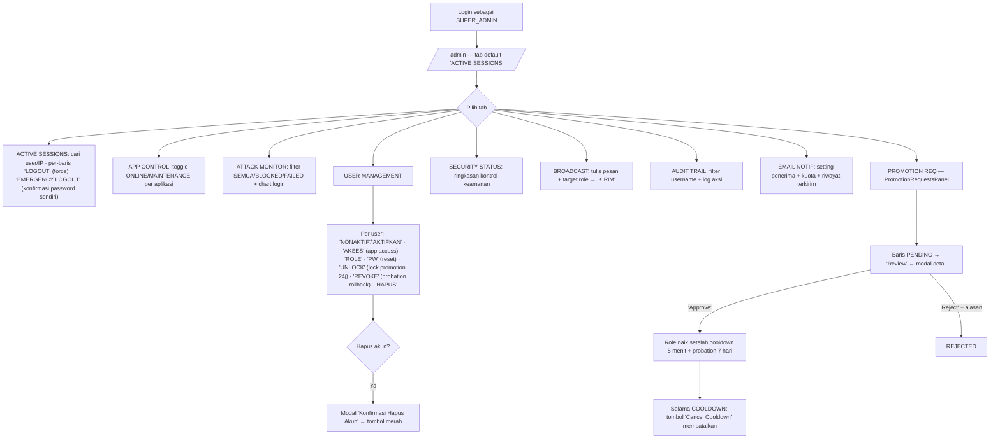

# WORKFLOW — Admin Panel (`/admin`)

**Fungsi**: pusat kendali sistem-wide — sesi aktif, on/off aplikasi (maintenance), monitor serangan login, manajemen user penuh (status/role/password/akses app/hapus), status keamanan, broadcast pesan, audit trail, notifikasi email, dan persetujuan Promotion Request (role ladder).
**Role**: **SUPER_ADMIN saja** — guard ganda: `proxy.ts` `ROLE_ROUTES['/admin'] = ['SUPER_ADMIN']` + `page.tsx` redirect ke `/menu`. (ADMIN mengelola role user via panel "Kelola User" di `/usulan-kebutuhan`, jangan dicampur.) Di dalam client masih ada cek `isSA` per-aksi (defense-in-depth).
**File sumber**: `app/(dashboard)/admin/admin-client.tsx` (9 tab), `app/(dashboard)/admin/_panels/PromotionRequestsPanel.tsx`, API `app/api/admin/*`.

## Flowchart alur end-to-end

## Tabel langkah detail

| No | Halaman/URL | Tombol/elemen PERSIS | Aksi user | Hasil | Role |
|---|---|---|---|---|---|
| 1 | `/admin` | Bar tab: **"ACTIVE SESSIONS"**, **"APP CONTROL"**, **"ATTACK MONITOR"**, **"USER MANAGEMENT"**, **"SECURITY STATUS"**, **"BROADCAST"**, **"AUDIT TRAIL"**, **"EMAIL NOTIF"**, **"PROMOTION REQ"** (admin-client.tsx `TABS`) | Klik | Ganti tab | SUPER_ADMIN |
| 2 | tab ACTIVE SESSIONS | Input **"Cari username atau IP..."** · **"REFRESH"** · per-baris **"LOGOUT"** (force logout sesi lain) · **"EMERGENCY LOGOUT"** (merah) → modal isi **"Password Anda..."** | Klik | Putus sesi user; emergency = logout massal dgn re-auth password | SUPER_ADMIN |
| 3 | tab APP CONTROL | Kartu per aplikasi (label dari `APP_STATUS_LABELS`) + badge **"ONLINE"**/**"MAINTENANCE"** + toggle switch (`ap-toggle`) | Geser toggle | App flag `app_status_*` di DB — user non-admin melihat halaman maintenance | SUPER_ADMIN (non-SA: banner "Hanya SUPER_ADMIN yang dapat mengubah status aplikasi.") |
| 4 | tab ATTACK MONITOR | Pill filter **"SEMUA"** / **"BLOCKED"** / **"FAILED"** + **"REFRESH"** + chart login/failed/blocked | Pantau | Data percobaan login | SUPER_ADMIN |
| 5 | tab USER MANAGEMENT | Search **"Cari username / nama / email..."** + filter status (AKTIF/NONAKTIF/…) + **"CARI"** | Cari | List user paginated | SUPER_ADMIN |
| 6 | tab USER MANAGEMENT, per baris | **"NONAKTIF"** / **"AKTIFKAN"** · **"AKSES"** (modal checklist app → simpan via action `set-app-access`) · **"ROLE"** (modal pilih role → **"Simpan"**) · **"PW"** (modal "Password baru (min 8, A-Z, a-z, 0-9)..." → **"Reset"**) · **"UNLOCK"** (Tip "Reset lock 24 jam promotion") · **"REVOKE"** (Tip "Probation aktif (rollback ke <role>)") · **"HAPUS"** (bukan SUPER_ADMIN) → modal **"Konfirmasi Hapus Akun"** | Klik | PATCH `/api/admin/users` per action; kuota role dicek server (ROLE_QUOTA/ADMIN_QUOTA/SUPER_ADMIN_QUOTA) | SUPER_ADMIN |
| 7 | tab BROADCAST | Section **"KIRIM BROADCAST"**: textarea **"Tulis pesan broadcast..."** + select target role + tombol **"KIRIM"** (`ap-btn-green`) · riwayat broadcast di bawah | Kirim | POST `/api/admin/broadcast` — notifikasi ke user target | SUPER_ADMIN |
| 8 | tab AUDIT TRAIL | Input **"Filter username..."** (Enter) + tabel log | Telusuri | Baca `audit_log` | SUPER_ADMIN |
| 9 | tab EMAIL NOTIF | Setting penerima (placeholder "admin@example.com"), kuota ("Terkirim Hari Ini/Bulan Ini"), **"RIWAYAT EMAIL TERKIRIM (20 TERAKHIR)"** | Atur | Konfigurasi notifikasi email | SUPER_ADMIN |
| 10 | tab PROMOTION REQ (`PromotionRequestsPanel.tsx`) | Filter status (PENDING/COOLDOWN/COMPLETED/REJECTED/EXPIRED/CANCELLED) · **"Refresh"** · per baris **"Review"** (`ghost`) atau **"Cancel Cooldown"** (`warning`, saat COOLDOWN) | Klik | Modal detail request | SUPER_ADMIN |
| 11 | modal review promotion | **"Approve"** (`success`) / **"Reject"** (`danger`) → modal alasan → konfirmasi · **"Tutup"** | Putuskan | Approve → cooldown 5 menit → role aktif + probation 7 hari (REVOKE 1-klik di User Management); PENDING >48 jam auto-EXPIRED | SUPER_ADMIN |

## Usulan anchor `data-rima` (BELUM dipasang — usulan)

| Anchor | Elemen | File |
|---|---|---|
| `admin.tab-sessions` | Tab "ACTIVE SESSIONS" | admin-client.tsx |
| `admin.tab-user-mgmt` | Tab "USER MANAGEMENT" | admin-client.tsx |
| `admin.tab-promotion` | Tab "PROMOTION REQ" | admin-client.tsx |
| `admin.sessions-emergency` | Tombol "EMERGENCY LOGOUT" | admin-client.tsx |
| `admin.sessions-force-logout` | Tombol "LOGOUT" per baris | admin-client.tsx |
| `admin.appctl-toggle` | Toggle ONLINE/MAINTENANCE kartu app | admin-client.tsx |
| `admin.user-cari` | Search "Cari username / nama / email..." | admin-client.tsx |
| `admin.user-akses` | Tombol "AKSES" (app access) | admin-client.tsx |
| `admin.user-role` | Tombol "ROLE" | admin-client.tsx |
| `admin.user-pw` | Tombol "PW" (reset password) | admin-client.tsx |
| `admin.user-hapus` | Tombol "HAPUS" | admin-client.tsx |
| `admin.user-unlock` | Tombol "UNLOCK" (promotion lock) | admin-client.tsx |
| `admin.user-revoke` | Tombol "REVOKE" (probation rollback) | admin-client.tsx |
| `admin.broadcast-kirim` | Tombol "KIRIM" broadcast | admin-client.tsx |
| `admin.promo-review` | Tombol "Review" baris request | _panels/PromotionRequestsPanel.tsx |
| `admin.promo-approve` | Tombol "Approve" | _panels/PromotionRequestsPanel.tsx |
| `admin.promo-reject` | Tombol "Reject" | _panels/PromotionRequestsPanel.tsx |
| `admin.promo-cancel-cooldown` | Tombol "Cancel Cooldown" | _panels/PromotionRequestsPanel.tsx |

## Skenario tur yang disarankan

### Tur 1 — `admin-kelola-user`
1. `admin.tab-user-mgmt` — "Manajemen user sistem-wide ada di sini (beda dengan 'Kelola User' modul Usulan yang cuma ubah role)."
2. `admin.user-cari` — "Cari berdasarkan username/nama/email."
3. `admin.user-akses` — "Grant akses modul (BLUD/BBA/LKJIP/PK/Kinerja) ke role di luar allow-list lewat checklist app."
4. `admin.user-role` + `admin.user-pw` — "Ubah role (kuota dicek otomatis) dan reset password."
5. `admin.user-hapus` — (Latihan: peringatan mutasi) "Hapus akun permanen — perlu konfirmasi."

### Tur 2 — `admin-promotion`
1. `admin.tab-promotion` — "Permintaan kenaikan role masuk ke sini."
2. `admin.promo-review` — "Review detail pemohon + chain promosi."
3. `admin.promo-approve` — "Approve → role aktif setelah cooldown 5 menit, masa percobaan 7 hari."
4. `admin.promo-cancel-cooldown` / `admin.user-revoke` — "Berubah pikiran? Batalkan saat cooldown, atau REVOKE selama probation."

### Tur 3 — `admin-maintenance`
1. `admin.appctl-toggle` — "Matikan satu aplikasi untuk maintenance — user melihat halaman maintenance, admin tetap bisa masuk."
2. `admin.broadcast-kirim` — "Umumkan ke semua user (atau role tertentu) lewat broadcast."
3. `admin.sessions-emergency` — "Darurat: logout semua sesi — perlu konfirmasi password Anda."

> TODO screenshot: tab ACTIVE SESSIONS, USER MANAGEMENT (modal AKSES), PROMOTION REQ (modal review).
