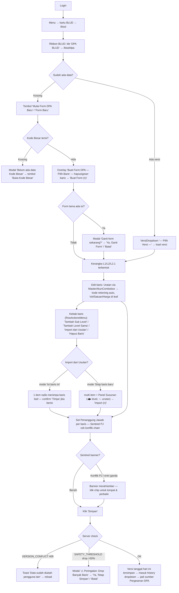

# WORKFLOW — BLUD · DPA BLUD (`/blud/dpa`)

**Fungsi**: menyusun Dokumen Pelaksanaan Anggaran (DPA) BLUD berbentuk pohon hierarki Level 1 → Level 8.1 (chain rule strict, leaf = bisa input vol/harga, induk = agregator otomatis), dengan import item dari Usulan final, Sentinel PJ (anti-konflik Penanggung Jawab), Sentinel Guard (anti entri ganda), dan versioning per-tanggal.
**Role**: `BLUD_ALLOWED_ROLES = ['SUPER_ADMIN','ADMIN']` (`lib/blud/schemas.ts` → `isBludRole`); role lain via grant `app_access` berisi `'blud'` di Admin Panel.
**File sumber**: `app/(dashboard)/blud/dpa/dpa-client.tsx`, `components/blud/` (ImportUsulanModal, RowActionsMenu, AddBarisModal, VersiDropdown, MasterAkunCombobox, PenanggungJawabCombobox, PjGuardDialogs, BlockedModal), `lib/blud/recalc.ts`, `lib/blud/dup-guard.ts`, navigasi shell `app/(dashboard)/blud/blud-shell.tsx`.

## Flowchart alur end-to-end

## Tabel langkah detail

| No | Halaman/URL | Tombol/elemen PERSIS | Aksi user | Hasil | Role |
|---|---|---|---|---|---|
| 1 | `/blud` | Ribbon tile **"DPA BLUD"** (grup ANGGARAN, blud-shell.tsx) | Klik | Masuk `/blud/dpa` | isBludRole |
| 2 | `/blud/dpa` | Toolbar header "Form BLUD — DPA BLUD": **`VersiDropdown`** placeholder **"— Pilih Versi —"** | Pilih tanggal versi | `GET /api/blud/dpa?tanggal=` — load snapshot versi itu | isBludRole |
| 3 | `/blud/dpa` | **"Form Baru"** (`PrimaButton purple`, dpa-client.tsx) atau **"Mulai Form DPA Baru"** (empty state) | Klik | Fetch Kode Besar → overlay pilih baris; kalau Kode Besar kosong → modal **"Belum ada data Kode Besar"** dengan tombol **"Buka Kode Besar"** | isBludRole |
| 4 | overlay **"Buat Form DPA — Pilih Baris"** | Per baris: ikon panah ⬆⬇ (tooltip **"Pindah ke atas/bawah"**), `DeleteButton` (tooltip **"Hapus dari list"**) · footer **"Buat Form (n)"** / **"Batal"** | Kurasi baris template | Build kerangka L1→L2→L2.1; kalau editor berisi → modal **"Ganti form sekarang?"** → **"Ya, Ganti Form"** | isBludRole |
| 5 | tabel DPA | Kolom **Uraian** = `MasterAkunCombobox` (ketik/cari akun) | Pilih akun | Uraian + **Kode Rekening** (read-only) terisi atomik | isBludRole |
| 6 | tabel DPA | Kolom **Vol** (input number), **Satuan** (`SatuanCombobox`), **Harga (Rp)** (`InputNominal`) — hanya baris LEAF (✎); **Jumlah (Rp)** dihitung otomatis | Isi angka | `partialRecalcDpa` — jumlah induk = Σ anak | isBludRole |
| 7 | tabel DPA | Kebab **Aksi** per baris = `RowActionsMenu`: **"Tambah Sub Level"** · **"Tambah Level Sama"** · **"Import dari Usulan"** · **"Hapus Baris"** (data-tooltip) | Klik item menu | Tambah Sub Level → `AddBarisModal` pilih tipe anak; baris leaf yang dapat anak otomatis jadi agregator (vol/harga di-clear) | isBludRole |
| 8 | tabel DPA | Hapus baris induk → modal **"Tidak Bisa Menghapus"** ("punya n anak... hapus semua anak terlebih dahulu") → **"Mengerti"** | — | Guard cascade-delete manual | isBludRole |
| 9 | tabel DPA | Checkbox kolom-1 + panah ChevronUp/Down (tooltip "Geser atas/bawah" / "Centang dulu untuk geser grup") · bila ada pilihan: **"Hapus Terpilih (n)"** (`PrimaButton danger`) | Centang subtree → geser blok / hapus massal | Sentinel Swap jaga struktur; konfirmasi **"Hapus Baris Terpilih"** | isBludRole |
| 10 | modal **"Import dari Usulan Kebutuhan"** (`ImportUsulanModal.tsx`) | Pill mode: **"Isi baris ini"** (amber, disabled jika anchor punya anak) / **"Sisip baris baru"** (ungu) · rail kiri JENIS BELANJA → sub-bidang · search **"Cari item / no. usulan…"** | Pilih mode + item | Mode fill = radio 1 item; mode insert = checkbox multi → dock kanan **"SUSUNAN (n)"** | isBludRole |
| 11 | modal import, dock Susunan | Kontrol per entri: ◀ (**"Naik level"**), ▶ (**"Turun level"**), ↑ (**"Pindah ke atas"**), ↓ (**"Pindah ke bawah"**), ✕ (**"Keluarkan dari susunan"**) · footer **"Import (n)"** (insert) / **"Isi Baris Ini"** (fill) / **"Batal"** | Atur indentasi & urutan | Insert: baris baru di bawah anchor, parent resolve dari susunan. Fill: timpa uraian/vol/satuan/harga baris anchor (kode rekening/PJ/posisi dipertahankan); baris berisi → confirmDialog **"Timpa Isi Baris"** tombol **"Timpa"** | isBludRole |
| 12 | tabel DPA | Kolom **Penanggung Jawab** = `PenanggungJawabCombobox` placeholder **"— Pilih PJ —"** | Pilih PJ | Sentinel PJ: konflik chain vertikal → `PjConflictDialog`; tambah baris di bawah baris ber-PJ → `PjMutationDialog` (Tetap/Hapus/Batal); banner **"n konflik Penanggung Jawab"** dengan chip lompat | isBludRole |
| 13 | atas tabel | Banner Sentinel Guard **"n kemungkinan entri ganda"** (dup-guard: HARD usulan_item_id kembar + heuristik uraian+satuan+harga) | Klik chip | Lompat ke baris terduga dobel | isBludRole |
| 14 | toolbar bawah header | Search **"Cari kode / uraian, lalu Enter..."** + tombol **"Jump"** · chip legenda **"Level 1"… "Level 4.1 ✎"** + **"Level Lainnya"** (toggle tampil/sembunyi level) | Ketik/klik | Lompat + highlight baris; filter render level | isBludRole |
| 15 | toolbar | **"Simpan"** (`PrimaButton primary`, dpa-client.tsx) | Klik | POST `/api/blud/dpa` (versi = tanggal hari ini, optimistic lock `expected_version`). 409 VERSION_CONFLICT → reload; 409 SAFETY_THRESHOLD → modal **"⚠️ Peringatan: Drop Banyak Baris"** → **"Ya, Tetap Simpan"**; server juga validasi `validateTreeIntegrity` (anti import dobel, 400) | isBludRole |

## Usulan anchor `data-rima` (BELUM dipasang — usulan)

| Anchor | Elemen | File |
|---|---|---|
| `dpa.versi-dropdown` | VersiDropdown "— Pilih Versi —" | components/blud/VersiDropdown.tsx |
| `dpa.form-baru` | Tombol "Form Baru" / "Mulai Form DPA Baru" | dpa-client.tsx |
| `dpa.overlay-buat-form` | Tombol "Buat Form (n)" di overlay Kode Besar | dpa-client.tsx |
| `dpa.kolom-uraian` | MasterAkunCombobox kolom Uraian (baris pertama terlihat) | dpa-client.tsx |
| `dpa.kolom-vol` | Input Vol baris leaf | dpa-client.tsx |
| `dpa.kolom-pj` | PenanggungJawabCombobox "— Pilih PJ —" | dpa-client.tsx |
| `dpa.kebab-aksi` | Kebab RowActionsMenu kolom Aksi | components/blud/RowActionsMenu.tsx |
| `dpa.kebab-import` | Item menu "Import dari Usulan" | components/blud/RowActionsMenu.tsx |
| `dpa.import-mode-fill` | Pill "Isi baris ini" | components/blud/ImportUsulanModal.tsx |
| `dpa.import-mode-insert` | Pill "Sisip baris baru" | components/blud/ImportUsulanModal.tsx |
| `dpa.import-susunan` | Dock "SUSUNAN (n)" | components/blud/ImportUsulanModal.tsx |
| `dpa.import-submit` | Tombol "Import (n)" / "Isi Baris Ini" | components/blud/ImportUsulanModal.tsx |
| `dpa.sentinel-pj-banner` | Banner "n konflik Penanggung Jawab" | dpa-client.tsx |
| `dpa.sentinel-dup-banner` | Banner "n kemungkinan entri ganda" | dpa-client.tsx |
| `dpa.search-jump` | Input "Cari kode / uraian..." + tombol "Jump" | dpa-client.tsx |
| `dpa.legend-chips` | Chip legenda Level 1..Level Lainnya | dpa-client.tsx |
| `dpa.hapus-terpilih` | Tombol "Hapus Terpilih (n)" | dpa-client.tsx |
| `dpa.simpan` | Tombol "Simpan" | dpa-client.tsx |

> Catatan: anchor `dpa.kunci-versi` di contoh CONCEPT §6 **belum punya tombol nyata** di dpa-client.tsx — DPA tidak punya aksi "kunci versi"; versi otomatis per-tanggal dan jadi acuan Pergeseran via "Buat Pergeseran"/"Sinkronkan DPA". Hapus/kelola versi ada di `/blud/pengaturan`.

## Skenario tur yang disarankan

### Tur 1 — `dpa-end-to-end` (buat DPA dari nol)
1. `dpa.versi-dropdown` — "Pilih versi lama, atau mulai baru."
2. `dpa.form-baru` — "Form Baru membangun kerangka dari template Kode Besar (kalau kosong, isi dulu di menu Kode Besar)."
3. `dpa.overlay-buat-form` — "Kurasi baris yang mau dipakai, lalu **Buat Form (n)**."
4. `dpa.kolom-uraian` — "Ketik untuk cari Master Akun — kode rekening terisi otomatis (read-only)."
5. `dpa.kolom-vol` — "Vol/Satuan/Harga hanya di baris ✎ (leaf); jumlah induk dihitung otomatis."
6. `dpa.kolom-pj` — "Tetapkan Penanggung Jawab — aku mengawasi konflik chain vertikal."
7. `dpa.simpan` — (Latihan: peringatan mutasi) "Simpan jadi versi tanggal hari ini — server cek versi & entri ganda dulu."

### Tur 2 — `import-usulan` (tarik item Usulan ke DPA)
1. `dpa.kebab-aksi` → `dpa.kebab-import` — "Klik kebab di baris L2 ke bawah → **Import dari Usulan**."
2. `dpa.import-mode-fill` / `dpa.import-mode-insert` — "Dua mode: timpa baris ini (1 item) atau sisip baris baru (multi)."
3. `dpa.import-susunan` — "Mode sisip: susun pohon di Panel Susunan — ◀▶ ganti level, ↑↓ urutan."
4. `dpa.import-submit` — "Item yang sudah ada di form otomatis di-disable (anti-dobel)."
5. `dpa.sentinel-dup-banner` — "Kalau tetap ada kembaran, banner ini menunjukkannya — klik untuk lompat."

### Tur 3 — `dpa-navigasi-cepat` (locate)
1. `dpa.search-jump` — "Cari kode/uraian lalu Enter — baris di-highlight."
2. `dpa.legend-chips` — "Klik chip level untuk sembunyikan/tampilkan level tertentu."
3. `dpa.hapus-terpilih` — "Centang subtree → hapus massal atau geser blok pakai panah."

> TODO screenshot: landing /blud/dpa (tabel hierarki), overlay Buat Form dari Kode Besar, modal Import dari Usulan (mode sisip dgn Panel Susunan), banner Sentinel PJ.
