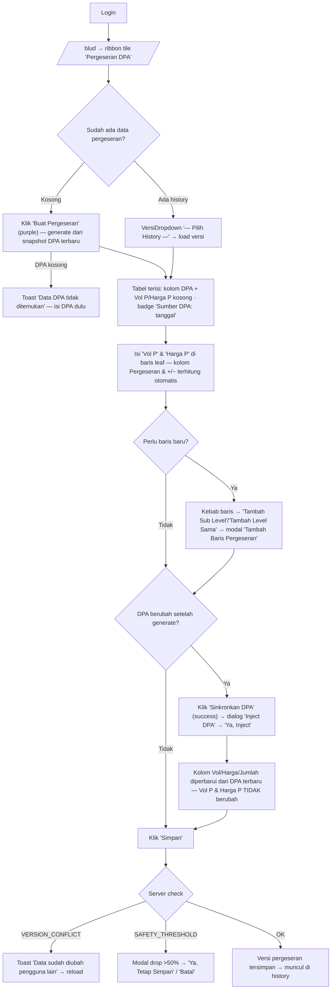

# WORKFLOW — BLUD · Pergeseran DPA (`/blud/pergeseran`)

**Fungsi**: menyusun tabel pergeseran anggaran berbasis snapshot DPA terbaru — kolom kiri (Vol/Harga/Jumlah) = nilai DPA, kolom **Vol P / Harga P** = nilai setelah pergeseran; kolom **Pergeseran** dan **+/−** dihitung otomatis. Tombol "Sinkronkan DPA" (inject) menarik ulang kolom DPA tanpa menyentuh Vol P/Harga P.
**Role**: sama dengan DPA — `isBludRole` (`SUPER_ADMIN`, `ADMIN`, atau grant app_access `'blud'`).
**File sumber**: `app/(dashboard)/blud/pergeseran/pergeseran-client.tsx`, shared `components/blud/` (RowActionsMenu, VersiDropdown, BlockedModal), API `app/api/blud/pergeseran/` (+ `inject/route.ts`).

## Flowchart alur end-to-end

## Tabel langkah detail

| No | Halaman/URL | Tombol/elemen PERSIS | Aksi user | Hasil | Role |
|---|---|---|---|---|---|
| 1 | `/blud` | Ribbon tile **"Pergeseran DPA"** (grup ANGGARAN, blud-shell.tsx) | Klik | Masuk `/blud/pergeseran` | isBludRole |
| 2 | toolbar "Pergeseran DPA" | **"Buat Pergeseran"** (`PrimaButton purple`, tooltip "Buat tabel pergeseran dari snapshot DPA terbaru") | Klik | `GET /api/blud/dpa` → tabel pergeseran baru, Vol P/Harga P null, badge **"Sumber DPA: <tanggal>"**; jika DPA kosong → toast "Data DPA tidak ditemukan" | isBludRole |
| 3 | toolbar | **"Sinkronkan DPA"** (`PrimaButton success`, tooltip "Sinkronkan kolom kode/uraian/vol/harga dari DPA terbaru") | Klik | Dialog **"Inject DPA"** ("Kolom Vol, Harga, Jumlah akan diperbarui... Vol P dan Harga P tidak akan berubah") → **"Ya, Inject"** / **"Batal"** → POST `/api/blud/pergeseran/inject` | isBludRole |
| 4 | toolbar | **`VersiDropdown`** placeholder **"— Pilih History —"** | Pilih tanggal | Load versi pergeseran tersimpan | isBludRole |
| 5 | tabel | Kolom **"Vol P"** & **"Harga P"** (editable di baris LEAF; kolom Uraian pakai combobox "Cari atau ketik uraian...", kode rekening "auto-fill dari pilihan uraian") | Isi angka | Kolom **"Pergeseran"** dan **"+/−"** ter-recalc otomatis (selisih vs DPA) | isBludRole |
| 6 | tabel | Kebab `RowActionsMenu`: **"Tambah Sub Level"** / **"Tambah Level Sama"** → modal **"Tambah Baris Pergeseran"** (pilih `+ Level ...`); **Hapus** hanya untuk baris BARU (tooltip "Hapus baris (hanya untuk baris baru)"; agregator: "Aggregator: hapus anak dulu") | Klik | Baris pergeseran baru ditambahkan; baris bawaan DPA tidak bisa dihapus | isBludRole |
| 7 | tabel | Checkbox + panah geser (Sentinel Swap, sama dgn DPA) · **"Hapus Terpilih (n)"** bila ada seleksi | Centang & aksi | Geser blok / multi-hapus (dengan confirmDialog) | isBludRole |
| 8 | bar bawah toolbar | Search **"Cari kode / uraian, lalu Enter..."** + chip legenda level (sama pola DPA) | Ketik/klik | Jump + highlight; filter level | isBludRole |
| 9 | toolbar | **"Simpan"** (`PrimaButton primary`) | Klik | POST `/api/blud/pergeseran` (kirim `dpa_versi_tanggal` + `expected_version`); 409 VERSION_CONFLICT → reload; 409 SAFETY_THRESHOLD → modal **"Ya, Tetap Simpan"** | isBludRole |

## Usulan anchor `data-rima` (BELUM dipasang — usulan)

| Anchor | Elemen | File |
|---|---|---|
| `pergeseran.buat` | Tombol "Buat Pergeseran" | pergeseran-client.tsx |
| `pergeseran.sinkron-dpa` | Tombol "Sinkronkan DPA" | pergeseran-client.tsx |
| `pergeseran.inject-confirm` | Tombol "Ya, Inject" di dialog Inject DPA | pergeseran-client.tsx |
| `pergeseran.versi-dropdown` | VersiDropdown "— Pilih History —" | pergeseran-client.tsx |
| `pergeseran.sumber-dpa` | Badge "Sumber DPA: <tanggal>" | pergeseran-client.tsx |
| `pergeseran.kolom-vol-p` | Input "Vol P" baris leaf | pergeseran-client.tsx |
| `pergeseran.kolom-harga-p` | Input "Harga P" baris leaf | pergeseran-client.tsx |
| `pergeseran.kolom-selisih` | Kolom "Pergeseran" / "+/−" | pergeseran-client.tsx |
| `pergeseran.kebab-aksi` | Kebab RowActionsMenu | components/blud/RowActionsMenu.tsx |
| `pergeseran.simpan` | Tombol "Simpan" | pergeseran-client.tsx |

## Skenario tur yang disarankan

### Tur 1 — `pergeseran-dasar`
1. `pergeseran.buat` — "Mulai dengan **Buat Pergeseran** — tabel dibangun dari snapshot DPA terbaru."
2. `pergeseran.sumber-dpa` — "Badge ini menunjukkan versi DPA yang jadi basis."
3. `pergeseran.kolom-vol-p` + `pergeseran.kolom-harga-p` — "Isi nilai SETELAH pergeseran di sini — kolom kiri tetap nilai DPA."
4. `pergeseran.kolom-selisih` — "Selisih dihitung otomatis di kolom Pergeseran dan +/−."
5. `pergeseran.simpan` — (Latihan: peringatan mutasi) "Simpan versi pergeseran."

### Tur 2 — `pergeseran-sinkron` (DPA berubah setelah pergeseran dibuat)
1. `pergeseran.sinkron-dpa` — "DPA baru saja diedit? **Sinkronkan DPA** menarik ulang kolom kiri."
2. `pergeseran.inject-confirm` — "Vol P dan Harga P TIDAK ikut berubah — aman."
3. `pergeseran.kebab-aksi` — "Butuh baris yang tidak ada di DPA? Tambah lewat kebab; hanya baris baru yang bisa dihapus."

> TODO screenshot: landing /blud/pergeseran (tabel dengan kolom Vol P/Harga P), dialog Inject DPA.
