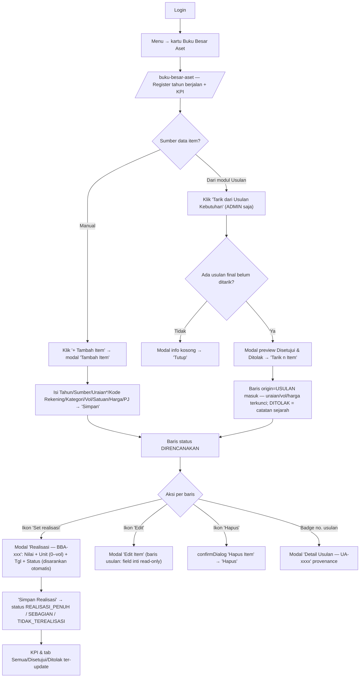

# WORKFLOW — Buku Besar Aset / BBA (`/buku-besar-aset`)

**Fungsi**: register belanja modal lintas-tahun — catat rencana aset (manual atau tarik dari Usulan final), set realisasi (nilai + unit + tanggal), pantau KPI (Total Rencana/Realisasi/% Terakomodir/backlog/unit). Status 4: DIRENCANAKAN / REALISASI_PENUH / REALISASI_SEBAGIAN / TIDAK_TEREALISASI. `nilai_rencana` = vol × harga otomatis (server).
**Role**: `ASET_ALLOWED_ROLES = ['SUPER_ADMIN','ADMIN']` (`lib/data/buku-besar-aset-schemas.ts` → `isAsetRole`); role lain via grant app_access `'buku_besar_aset'`. Tombol "Tarik dari Usulan Kebutuhan" hanya ADMIN/SUPER_ADMIN (`canImport` di client + guard endpoint).
**File sumber**: `app/(dashboard)/buku-besar-aset/buku-besar-aset-client.tsx`, `app/api/buku-besar-aset/` (`route.ts`, `realisasi/route.ts`, `import-usulan/route.ts`, `_guard.ts`), `lib/data/buku-besar-aset.ts`. Sub-halaman master kategori: `/buku-besar-aset/master`.

## Flowchart alur end-to-end

## Tabel langkah detail

| No | Halaman/URL | Tombol/elemen PERSIS | Aksi user | Hasil | Role |
|---|---|---|---|---|---|
| 1 | `/buku-besar-aset` | Header "📦 Buku Besar Aset" + 5 kartu KPI: **"Total Rencana"**, **"Total Realisasi"**, **"% Terakomodir"**, **"Belum Terealisasi (item)"**, **"Unit Terealisasi"** | Lihat | Ringkasan register tahun aktif (baris usulan DITOLAK dikecualikan dari KPI) | isAsetRole |
| 2 | `/buku-besar-aset` | **"+ Tambah Item"** (`PrimaButton purple`) → modal **"Tambah Item"** | Isi field: Tahun, Sumber, **"Uraian *"**, Kode Rekening, Kategori Aset ("Pilih / ketik kategori…"), Vol, Satuan, Harga, **"Nilai Rencana (vol × harga)"** (read-only), Penanggung Jawab, Keterangan → **"Simpan"** | POST `/api/buku-besar-aset` — item baru `canonical_id` BBA-, status DIRENCANAKAN | isAsetRole |
| 3 | `/buku-besar-aset` | **"Tarik dari Usulan Kebutuhan"** (`PrimaButton purple`, ikon Download) | Klik | POST mode `preview` → modal **"Tarik dari Usulan Kebutuhan — <tahun>"** berisi grup badge **DISETUJUI** / **DITOLAK** (count + total) | ADMIN, SUPER_ADMIN |
| 4 | modal tarik | **"Tarik n Item"** (`purple`) / **"Batal"** · catatan "Item yang sudah pernah ditarik dilewati otomatis. Sumber anggaran default BLUD" | Klik | POST mode `commit` — insert origin=USULAN; anti double-entry via UNIQUE `usulan_item_id` | ADMIN, SUPER_ADMIN |
| 5 | filter bar | Input Tahun (`PrimaNumberField`), select **"Semua status"** / **"Semua sumber"** / **"Semua asal"** (Manual/Dari Usulan), input **"Cari uraian/kode/no. usulan…"**, tombol **"Terapkan"** | Set filter | Auto-refresh (debounce 350ms) kecuali pencarian teks (Enter / Terapkan) | isAsetRole |
| 6 | tab pill | **"Semua"** / **"Disetujui"** / **"Ditolak"** | Klik | Filter `keputusan` usulan | isAsetRole |
| 7 | tabel, kolom Aksi | Ikon **"Edit"** (`EditButton`, Tip "Edit") → modal **"Edit Item"** | Edit | PATCH dengan `expected_version` (CAS L48); baris origin USULAN: banner "uraian, vol, dan harga terkunci", field tsb read-only | isAsetRole |
| 8 | tabel, kolom Aksi | Ikon **"Set realisasi"** (`RealisasiButton`; disembunyikan untuk baris DITOLAK) → modal **"Realisasi — <BBA-id>"** | Isi **"Nilai Realisasi"**, **"Unit Realisasi (0 – vol)"**, **"Tgl Realisasi"**, **"Status"** (disarankan otomatis dari `suggestStatus`) → **"Simpan Realisasi"** (`success`) | PATCH `/api/buku-besar-aset/realisasi`; VERSION_CONFLICT → toast + reload | isAsetRole |
| 9 | tabel, kolom Aksi | Ikon **"Hapus"** (`DeleteButton`) → confirmDialog title **"Hapus Item"**, tombol **"Hapus"** | Konfirmasi | DELETE `/api/buku-besar-aset?id=` | isAsetRole |
| 10 | tabel, kolom Asal | Badge no. usulan ungu (Tip **"Lihat detail usulan"**) | Klik | Modal **"Detail Usulan — <no>"**: No/Sub Bidang/Pengusul/Vol×Harga/Nilai/Keputusan (+ Catatan Penolakan bila ditolak) → **"Tutup"** | isAsetRole |
| 11 | FloatingDock bawah | Nav: **"Aset"** (current) / **"Master"** (→ `/buku-besar-aset/master`) / **"Kinerja"** (→ `/kinerja`) / **"Menu"** · Aksi cepat: **"Tambah"**, **"Filter"** (fokus search), **"Muat Ulang"** | Klik | Navigasi/aksi cepat | isAsetRole |

## Usulan anchor `data-rima` (BELUM dipasang — usulan)

| Anchor | Elemen | File |
|---|---|---|
| `bba.tambah-item` | Tombol "+ Tambah Item" | buku-besar-aset-client.tsx |
| `bba.tarik-usulan` | Tombol "Tarik dari Usulan Kebutuhan" | buku-besar-aset-client.tsx |
| `bba.tarik-commit` | Tombol "Tarik n Item" di modal preview | buku-besar-aset-client.tsx |
| `bba.kpi-cards` | Grid 5 kartu KPI | buku-besar-aset-client.tsx |
| `bba.tab-keputusan` | Pill "Semua / Disetujui / Ditolak" | buku-besar-aset-client.tsx |
| `bba.filter-tahun` | Input tahun register | buku-besar-aset-client.tsx |
| `bba.filter-cari` | Input "Cari uraian/kode/no. usulan…" + "Terapkan" | buku-besar-aset-client.tsx |
| `bba.row-edit` | Ikon EditButton baris | buku-besar-aset-client.tsx |
| `bba.row-realisasi` | Ikon RealisasiButton baris | buku-besar-aset-client.tsx |
| `bba.row-hapus` | Ikon DeleteButton baris | buku-besar-aset-client.tsx |
| `bba.realisasi-simpan` | Tombol "Simpan Realisasi" | buku-besar-aset-client.tsx |
| `bba.badge-usulan` | Badge no. usulan (detail provenance) | buku-besar-aset-client.tsx |
| `bba.dock` | FloatingDock (nav Master/Kinerja/Menu) | components/ui/FloatingDock.tsx |

## Skenario tur yang disarankan

### Tur 1 — `bba-tarik-usulan` (alur utama Admin)
1. `bba.tarik-usulan` — "Tarik semua usulan belanja modal yang sudah final (Disetujui Kabag / Ditolak) ke register."
2. `bba.tarik-commit` — (Latihan: peringatan mutasi) "Preview dulu — yang pernah ditarik otomatis dilewati."
3. `bba.tab-keputusan` — "Baris Ditolak tetap dicatat sebagai sejarah — tidak masuk KPI."
4. `bba.row-realisasi` — "Setelah belanja terjadi, klik ikon realisasi di baris."
5. `bba.realisasi-simpan` — "Isi nilai + unit; status disarankan otomatis (penuh/sebagian/tidak terealisasi)."

### Tur 2 — `bba-entry-manual`
1. `bba.tambah-item` — "Item di luar modul Usulan dicatat manual di sini."
2. (dalam modal) "Nilai Rencana dihitung otomatis = vol × harga — bukan input."
3. `bba.filter-tahun` — "Register per tahun anggaran; ganti tahun untuk melihat tahun lain."
4. `bba.dock` — "Dock bawah: pindah ke Master kategori, modul Kinerja, atau Menu."

> TODO screenshot: landing /buku-besar-aset (KPI + tabel), modal Tarik dari Usulan (preview), modal Realisasi.
