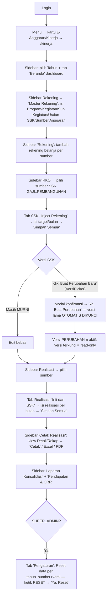

# WORKFLOW — E-Anggaran / Kinerja (`/kinerja`)

**Fungsi**: monitoring anggaran per sumber dana (8 sumber SSK: GAJI/BLUD/HARLEP/PROMKES/SARPRAS/OBAT/PEMELIHARAAN/PEMBANGUNAN) — master data → rekening belanja → RKO/SSK (target per bulan, versi MURNI/PERUBAHAN dengan kunci versi) → realisasi bulanan → cetak & laporan konsolidasi + Pendapatan & CRR.
**Role**: `KINERJA_ALLOWED_ROLES = ['SUPER_ADMIN','ADMIN','ADMIN_KASUBAG','ADMIN_KABAG','RENBANG','PROGRAM','KEUANGAN']` (`lib/data/kinerja-schemas.ts` → `isKinerjaRole`, app key `new_econtrolling`); `canEdit` di client = list yang sama. Tab **Pengaturan** hanya SUPER_ADMIN.
**File sumber**: `app/(dashboard)/kinerja/kinerja-client.tsx` (shell), `_components/Sidebar.tsx`+`Topbar.tsx`, `_tabs/` (9 tab), `components/kinerja/VersiPickerKinerja.tsx`, API `app/api/kinerja/*`.

## Flowchart alur end-to-end

## Tabel langkah detail

| No | Halaman/URL | Tombol/elemen PERSIS | Aksi user | Hasil | Role |
|---|---|---|---|---|---|
| 1 | `/kinerja` | Sidebar (`_components/Sidebar.tsx`): **"Beranda"**, section **Laporan** → **"Laporan Konsolidasi"**, section **Rekening** → **"Master Rekening"** & **"Rekening"**, section **RKO** → dropdown **"RKO"** (flyout "RKO — Sumber": SSK GAJI, SSK BLUD, SSK HARLEP, SSK PROMKES, SSK SARPRAS, SSK OBAT, SSK PEMELIHARAAN, SSK PEMBANGUNAN), section **Realisasi dan Cetak** → dropdown **"Realisasi"** + **"Cetak Realisasi"**, section **Pendapatan** → **"Pendapatan & CRR"**, section **Sistem** → **"Pengaturan"** (SUPER_ADMIN) · selector Tahun | Klik | Pindah tab (lazy-load Suspense) | isKinerjaRole |
| 2 | tab **Master Rekening** (`MasterTab.tsx`) | Pill tipe: Program / Kegiatan / Sub Kegiatan / Uraian SSK / Sumber Anggaran · input "Isi <tipe>..." · tombol **"Tambah"** (`purple`), **"Simpan"** (`success`), **"Simpan Perubahan"** (saat edit), **"Hapus Semua"** (`danger`), **"Init Renaksi"** (`purple`), per-baris ikon edit + **"Hapus"** | CRUD master | Confirm modal kustom "Ya, Lanjutkan"; Hapus Semua jaga data baru yang belum disimpan | canEdit |
| 3 | tab **Rekening** (`RekeningTab.tsx`) | Pill sumber SSK · form rekening (placeholder "Contoh: Belanja Gaji Pegawai") · **"Tambah"**/**"Update"** (`purple`) · **"Simpan"** (`success`) · DownloadButton **"Excel"** · **"Batal"** | Tambah rekening per sumber | Disimpan via `/api/kinerja/rekening` | canEdit |
| 4 | tab **SSK/RKO** (`SskTab.tsx`) | `VersiPickerKinerja` (pilih MURNI / PERUBAHAN-n; item terkunci ditandai) + tombol **"Buat Perubahan Baru"** (`VersiPickerKinerja.tsx`) | Klik | Modal konfirmasi: "versi <label> akan **otomatis dikunci**" → **"Ya, Buat Perubahan"** / batal — salin data ke PERUBAHAN baru | canEdit |
| 5 | tab SSK | **"Inject Rekening"** (`primary`, Tip "Inject dari Master Rekening"; disabled saat versi terkunci, Tip "Versi terkunci") · **"Simpan Semua"** (`success`) · **"Excel"** / **"PDF"** · per-baris ikon hapus (Tip "Hapus baris" / "Versi terkunci, gunakan Nol-kan di Perubahan") | Isi target per bulan | POST `/api/kinerja/ssk` versi-aware + optimistic lock (V3-6); versi terkunci → toast "sudah dikunci, tidak bisa diubah" | canEdit |
| 6 | tab **Realisasi** (`RealisasiTab.tsx`) | Pill sumber + pill bulan · **"Init dari SSK"** (`primary`, Tip "Buat baris untuk semua bulan dari data SSK") · **"Simpan Semua"** (`success`) · **"Excel"** / **"PDF"** · tombol hapus per-baris DIMATIKAN (Tip "Hapus realisasi dimatikan untuk menjaga integritas histori...") | Isi realisasi | POST `/api/kinerja/realisasi`; acuan versi diarsipkan → input baru diblok | canEdit |
| 7 | tab **Cetak Realisasi** (`CetakTab.tsx`) | Pill sumber · toggle view **detail/rekap** · select bulan ("semua"/per bulan) · **"Cetak"** (`purple`/`primary`, `window.print()`) · **"Excel"** / **"PDF"** | Klik | Lembar cetak "Cetak Realisasi <SUMBER> — <tahun>" | isKinerjaRole |
| 8 | tab **Pendapatan & CRR** (`PendapatanCrrTab.tsx`) | **"Simpan Pendapatan"** · **"Simpan CRR"** (`success`) · **"Excel"** per seksi · ikon per-baris (Tip "Auto-isi BLUD & Daerah dari Realisasi <bulan>") | Isi pendapatan/CRR bulanan | POST `/api/kinerja/pendapatan` | canEdit |
| 9 | tab **Laporan Konsolidasi** (`LaporanTab.tsx`) | Pill sumber · tombol refresh (`purple`, ikon RefreshCw) · **"Excel"** / **"PDF"** | Lihat/export | GET `/api/kinerja/laporan` | isKinerjaRole |
| 10 | tab **Pengaturan** (`PengaturanTab.tsx`) | Section **"Reset Data"**: pilih scope + versi → tombol **"Reset <scope> · <versi> — <sumber> <tahun>"** (`danger`) → modal **"Konfirmasi Reset Data"** ketik **"RESET"** → **"Ya, Reset"** | Reset destruktif | POST `/api/kinerja/reset` — hapus SSK+Realisasi sesuai scope; toast jumlah terhapus | SUPER_ADMIN |

## Usulan anchor `data-rima` (BELUM dipasang — usulan)

| Anchor | Elemen | File |
|---|---|---|
| `kinerja.sidebar-tahun` | Selector tahun di sidebar | _components/Sidebar.tsx |
| `kinerja.sidebar-master` | Item "Master Rekening" | _components/Sidebar.tsx |
| `kinerja.sidebar-rko` | Dropdown "RKO" (flyout sumber) | _components/Sidebar.tsx |
| `kinerja.sidebar-realisasi` | Dropdown "Realisasi" | _components/Sidebar.tsx |
| `kinerja.master-tambah` | Tombol "Tambah" MasterTab | _tabs/MasterTab.tsx |
| `kinerja.master-init-renaksi` | Tombol "Init Renaksi" | _tabs/MasterTab.tsx |
| `kinerja.rekening-tambah` | Tombol "Tambah"/"Update" RekeningTab | _tabs/RekeningTab.tsx |
| `kinerja.ssk-versi-picker` | VersiPickerKinerja (MURNI/PERUBAHAN) | components/kinerja/VersiPickerKinerja.tsx |
| `kinerja.ssk-buat-perubahan` | Tombol "Buat Perubahan Baru" | components/kinerja/VersiPickerKinerja.tsx |
| `kinerja.ssk-inject` | Tombol "Inject Rekening" | _tabs/SskTab.tsx |
| `kinerja.ssk-simpan` | Tombol "Simpan Semua" SSK | _tabs/SskTab.tsx |
| `kinerja.realisasi-init` | Tombol "Init dari SSK" | _tabs/RealisasiTab.tsx |
| `kinerja.realisasi-simpan` | Tombol "Simpan Semua" Realisasi | _tabs/RealisasiTab.tsx |
| `kinerja.cetak-print` | Tombol "Cetak" | _tabs/CetakTab.tsx |
| `kinerja.laporan-export` | DownloadButton Excel/PDF Laporan | _tabs/LaporanTab.tsx |
| `kinerja.pengaturan-reset` | Tombol "Reset … " + modal RESET | _tabs/PengaturanTab.tsx |

## Skenario tur yang disarankan

### Tur 1 — `kinerja-setup-awal` (dari master sampai SSK)
1. `kinerja.sidebar-tahun` — "Semua data terikat tahun — pastikan tahun benar dulu."
2. `kinerja.sidebar-master` — "Isi master: Program → Kegiatan → Sub Kegiatan → Uraian SSK → Sumber Anggaran."
3. `kinerja.rekening-tambah` — "Daftarkan rekening belanja per sumber dana."
4. `kinerja.sidebar-rko` — "Buka RKO, pilih sumber (mis. SSK BLUD)."
5. `kinerja.ssk-inject` — "**Inject Rekening** menarik rekening jadi baris SSK."
6. `kinerja.ssk-simpan` — (Latihan: peringatan mutasi) "Isi target per bulan lalu **Simpan Semua**."

### Tur 2 — `kinerja-versi-perubahan` (kunci versi)
1. `kinerja.ssk-versi-picker` — "Versi aktif tampil di sini: MURNI atau PERUBAHAN-n; ikon kunci = terkunci."
2. `kinerja.ssk-buat-perubahan` — "**Buat Perubahan Baru** menyalin data — versi lama OTOMATIS DIKUNCI dan tidak bisa diedit lagi."
3. `kinerja.realisasi-init` — "Realisasi mengacu versi SSK terbaru; acuan lama yang diarsipkan tidak bisa diinput."

### Tur 3 — `kinerja-realisasi-cetak`
1. `kinerja.sidebar-realisasi` — "Pilih sumber realisasi."
2. `kinerja.realisasi-init` → `kinerja.realisasi-simpan` — "Init baris dari SSK, isi realisasi per bulan, simpan. Catatan: baris realisasi tidak bisa dihapus — nol-kan target di SSK Perubahan."
3. `kinerja.cetak-print` — "Cetak per bulan/semua, atau export Excel/PDF."

> TODO screenshot: dashboard kinerja, tab SSK dengan VersiPicker, tab Realisasi, tab Pengaturan (reset).
