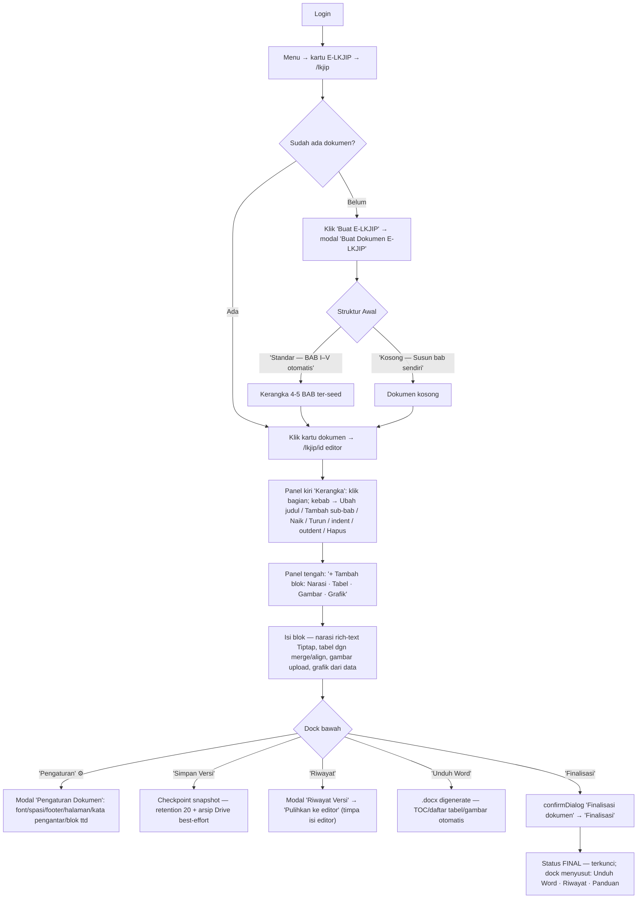

# WORKFLOW — E-LKJIP (`/lkjip`)

**Fungsi**: penyusun Laporan Kinerja (LKJIP) tahunan berbasis outline-tree — daftar dokumen → editor 3-panel (Kerangka · area Blok · kontrol) dengan blok Narasi (Tiptap)/Tabel/Gambar/Grafik, Pengaturan Dokumen (style/footer/ttd/kata pengantar), riwayat versi (snapshot + arsip Drive), generate Word .docx, dan Finalisasi (kunci dokumen).
**Role**: `LKJIP_ALLOWED_ROLES = ['SUPER_ADMIN','ADMIN']` (`lib/lkjip/schemas.ts` → `isLkjipRole`); role lain via grant app_access `'lkjip'`. Dokumen FINAL = read-only untuk semua.
**File sumber**: `app/(dashboard)/lkjip/lkjip-client.tsx` (daftar), `[id]/editor-client.tsx` (editor) + `[id]/TiptapNarasi.tsx`, API `app/api/lkjip/*`, lib `lib/lkjip/` (data/numbering/docgen/versi).

## Flowchart alur end-to-end

## Tabel langkah detail

| No | Halaman/URL | Tombol/elemen PERSIS | Aksi user | Hasil | Role |
|---|---|---|---|---|---|
| 1 | `/lkjip` | **"Buat E-LKJIP"** (`PrimaButton purple`) → modal **"Buat Dokumen E-LKJIP"**: field **"Tahun Laporan"**, **"Struktur Awal"** pilihan **"Standar — BAB I–V otomatis"** / **"Kosong — Susun bab sendiri"** → **"Buat"** | Isi & klik | POST `/api/lkjip` — dokumen DRAFT baru, redirect kartu | isLkjipRole |
| 2 | `/lkjip` | Kartu dokumen (tahun + badge DRAFT/FINAL + judul + canonical_id) · aksi kartu: `DownloadButton` **"Word"** (tooltip "Unduh Word"), ikon hapus (tooltip **"Hapus dokumen"**, hanya non-FINAL) → confirmDialog **"Hapus dokumen"** | Klik kartu | Masuk editor `/lkjip/[id]`; hapus = semua bab & isi terhapus permanen | isLkjipRole |
| 3 | `/lkjip` | `FloatingDock`: nav **"E-LKJIP"** / **"Menu"** · aksi **"Buat"**, **"Muat Ulang"** | Klik | Aksi cepat | isLkjipRole |
| 4 | `/lkjip/[id]` panel kiri **"Kerangka"** | **"Tambah Bab"** (`purple`) · per node: kebab (tooltip **"Aksi bagian"**) → menu: **"Ubah judul"**, **"Tambah sub-bab"**, **"Tambah bab"**/**"Tambah sub-bab (setelah ini)"**, **"Naik"**, **"Turun"**, **"Jadikan sub-bab (indent)"**, **"Naikkan satu tingkat"**/**"Jadikan bab"**, **"Hapus bagian ini"** (danger) | Susun pohon | Modal **"Tambah Section"** (input "Judul section" → **"Tambah"**); hapus → confirmDialog **"Hapus section"** (subtree ikut); nomor section dihitung otomatis (`numbering.ts`, tidak disimpan) | isLkjipRole (DRAFT) |
| 5 | panel tengah | Baris **"+ Tambah blok:"** → tombol **"Narasi"**, **"Tabel"**, **"Gambar"**, **"Grafik"** | Klik | Blok baru di section terpilih; grip "Seret untuk pindah blok"; ikon hapus blok (tooltip **"Hapus blok"**) → confirmDialog | isLkjipRole (DRAFT) |
| 6 | blok Tabel | Toolbar ikon (data-tooltip): **"Urungkan (Ctrl+Z)"**, **"Ulangi (Ctrl+Y)"**, **"Gabung sel"**, **"Pisah sel"**, rata kiri/tengah/kanan/kiri-kanan, vertikal atas/tengah · input **"Judul tabel (tanpa nomor — nomor otomatis)"** | Edit tabel | Nomor tabel/gambar otomatis (caption SEQ di Word) | isLkjipRole |
| 7 | `FloatingDock` editor (DRAFT) | **"Simpan Versi"** · **"Riwayat"** · **"Pengaturan"** · **"Unduh Word"** · **"Finalisasi"** · **"Panduan"** | Klik | Lihat baris 8-11 | isLkjipRole |
| 8 | dock → **"Pengaturan"** | Modal **"Pengaturan Dokumen"**: font/ukuran/spasi, nomor halaman + **footer** (placeholder "mis. RSJD Dr. Amino Gondohutomo"), **Kata Pengantar** ("Tulis kata pengantar — satu paragraf per baris…"), blok ttd (tempat-tanggal/nama/pangkat/NIP/jabatan) → **"Simpan"** | Atur style | PATCH `style_config` — dipakai docgen Word | isLkjipRole |
| 9 | dock → **"Simpan Versi"** | (aksi langsung) | Klik | Snapshot JSON ke `lkjip_versi` (retention 20) + arsip docx ke Drive best-effort | isLkjipRole |
| 10 | dock → **"Riwayat"** | Modal **"Riwayat Versi"**: per versi ikon **"Unduh arsip Drive"** + **"Pulihkan ke editor"** → confirmDialog **"Pulihkan versi"** ("Seluruh isi editor saat ini akan DIGANTI") tombol **"Pulihkan"** | Klik | POST `/versi/[versiId]/restore` | isLkjipRole |
| 11 | dock → **"Finalisasi"** | confirmDialog **"Finalisasi dokumen"** ("Dokumen akan dikunci dan tidak bisa diubah lagi") tombol **"Finalisasi"** | Konfirmasi | POST `/api/lkjip/[id]/finalize` — status FINAL, editor read-only, dock tinggal Unduh Word/Riwayat/Panduan | isLkjipRole |
| 12 | dock → **"Unduh Word"** | (aksi langsung, bisa kapan saja) | Klik | `GET /api/lkjip/[id]/generate` — murni download .docx (TOC + daftar tabel/gambar otomatis, tanpa efek samping) | isLkjipRole |
| 13 | dock → **"Panduan"** | Modal **"Panduan Penyusun LKJIP"** (akordeon langkah-langkah) | Baca | Bantuan built-in — konten bagus untuk dipinjam RIMA | isLkjipRole |

## Usulan anchor `data-rima` (BELUM dipasang — usulan)

| Anchor | Elemen | File |
|---|---|---|
| `lkjip.buat` | Tombol "Buat E-LKJIP" | lkjip-client.tsx |
| `lkjip.buat-template` | Pilihan "Standar" / "Kosong" di modal buat | lkjip-client.tsx |
| `lkjip.kartu-dokumen` | Kartu dokumen pertama di grid | lkjip-client.tsx |
| `lkjip.tree` | Panel "Kerangka" (outline kiri) | [id]/editor-client.tsx |
| `lkjip.tree-tambah-bab` | Tombol "Tambah Bab" | [id]/editor-client.tsx |
| `lkjip.tree-kebab` | Kebab "Aksi bagian" pada node | [id]/editor-client.tsx |
| `lkjip.addblock` | Baris "+ Tambah blok: Narasi/Tabel/Gambar/Grafik" | [id]/editor-client.tsx |
| `lkjip.dock-simpan-versi` | Item dock "Simpan Versi" | [id]/editor-client.tsx |
| `lkjip.dock-riwayat` | Item dock "Riwayat" | [id]/editor-client.tsx |
| `lkjip.dock-pengaturan` | Item dock "Pengaturan" (⚙) | [id]/editor-client.tsx |
| `lkjip.dock-unduh` | Item dock "Unduh Word" | [id]/editor-client.tsx |
| `lkjip.dock-finalisasi` | Item dock "Finalisasi" | [id]/editor-client.tsx |
| `lkjip.dock-panduan` | Item dock "Panduan" | [id]/editor-client.tsx |

## Skenario tur yang disarankan

### Tur 1 — `lkjip-dokumen-baru`
1. `lkjip.buat` — "Mulai dari **Buat E-LKJIP**."
2. `lkjip.buat-template` — "Pilih Standar (BAB I–V otomatis) atau Kosong."
3. `lkjip.tree` — "Kerangka dokumen di kiri — klik bagian untuk mengisi."
4. `lkjip.addblock` — "Isi tiap bagian dengan blok: Narasi, Tabel, Gambar, Grafik — nomor otomatis."
5. `lkjip.dock-pengaturan` — "Atur font, footer, kata pengantar & tanda tangan di sini."
6. `lkjip.dock-unduh` — "Unduh Word kapan saja — daftar isi/tabel/gambar dibuat otomatis."

### Tur 2 — `lkjip-versi-final`
1. `lkjip.dock-simpan-versi` — "Checkpoint seluruh dokumen (beda dgn Simpan per-blok) — maks 20 versi + arsip Drive."
2. `lkjip.dock-riwayat` — "Pulihkan versi lama — isi editor sekarang DIGANTI, hati-hati."
3. `lkjip.dock-finalisasi` — (Latihan: peringatan mutasi) "Finalisasi MENGUNCI dokumen jadi FINAL — lakukan hanya kalau benar-benar selesai."

> Catatan menarik: editor LKJIP sudah punya modal **"Panduan Penyusun LKJIP"** built-in (`panduanOpen`) — kontennya bisa langsung jadi sumber knowledge base RIMA untuk modul ini.

> TODO screenshot: daftar dokumen /lkjip, editor 3-panel, modal Pengaturan Dokumen, modal Riwayat Versi.
