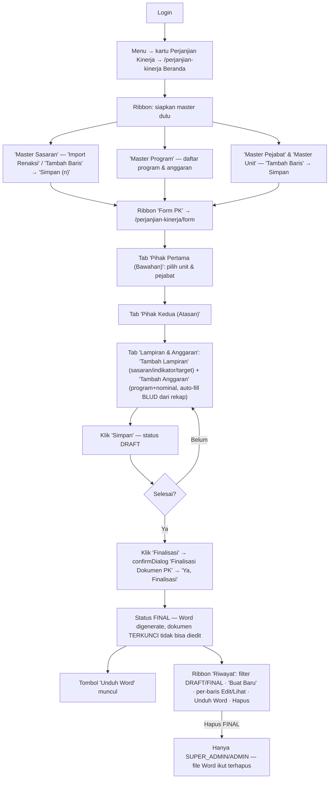

# WORKFLOW — Perjanjian Kinerja / PK (`/perjanjian-kinerja`)

**Fungsi**: menyusun dokumen Perjanjian Kinerja tahunan (Pihak Pertama/bawahan ↔ Pihak Kedua/atasan + lampiran sasaran-indikator-target + anggaran per program), generate Word (docxtemplater), riwayat dokumen DRAFT/FINAL, plus 4 master (Sasaran, Program, Pejabat, Unit Kerja).
**Role**: `PK_ALLOWED_ROLES = ['SUPER_ADMIN','ADMIN','ADMIN_KASUBAG','ADMIN_KABAG','RENBANG','PROGRAM']` (`lib/data/pk-schemas.ts` → `isPkRole`); mutasi via `PK_EDIT_ROLES` = sama minus **ADMIN_KABAG (read-only review)**. Hapus dokumen FINAL hanya SUPER_ADMIN/ADMIN.
**File sumber**: `app/(dashboard)/perjanjian-kinerja/` — `pk-shell.tsx` (ribbon nav), `page.tsx` (beranda), `form/form-client.tsx` + `form/_components/` (PihakPertamaForm, PihakKeduaForm, LampiranAnggaranSplit), `riwayat/riwayat-client.tsx`, `sasaran|program|pejabat|unit-kerja/*-client.tsx`; API `app/api/perjanjian-kinerja/` (8 route); generator `lib/pk/docgen.ts`.

## Flowchart alur end-to-end

## Tabel langkah detail

| No | Halaman/URL | Tombol/elemen PERSIS | Aksi user | Hasil | Role |
|---|---|---|---|---|---|
| 1 | `/perjanjian-kinerja` | Ribbon `pk-shell.tsx`: **"Beranda"** · grup PENCIPTAAN ARSIP: **"Master Sasaran"**, **"Master Program"** · grup DOKUMEN PK: **"Form PK"**, **"Riwayat"** · grup SISTEM: **"Master Pejabat"**, **"Master Unit"** · Beranda punya kartu "Form PK — Buat dokumen Perjanjian Kinerja baru" dll | Klik | Navigasi antar halaman PK | isPkRole |
| 2 | `/perjanjian-kinerja/sasaran` | Toolbar: **"Muat Ulang"** (`ghost`) · **"Import Renaksi"** (`purple`, tooltip "Tarik Sasaran + Indikator + Target dari Renaksi & Kinerja tahun <tahun>") → modal konfirmasi **"Ya, Tambahkan"** · **"Tambah Baris"** (`purple`) · **"Simpan (n)"** (`primary`) · ikon hapus merah per baris (tandai → Simpan) | Kelola master sasaran per tahun | Replace-all save ke `/api/perjanjian-kinerja/sasaran` | isPkEditRole |
| 3 | `/perjanjian-kinerja/pejabat`, `/unit-kerja`, `/program` | Pola sama: **"Muat Ulang"**, **"Tambah Baris"**, tombol hapus baris, **"Simpan"** | Kelola master | API masing-masing | isPkEditRole |
| 4 | `/perjanjian-kinerja/form` | Header "Form Perjanjian Kinerja" + badge Tahun/Jenis/Status · tombol kanan: **"Hapus"**/**"Reset"** (`danger`; FINAL → tooltip "Dokumen FINAL — hubungi SUPER_ADMIN") · **"Simpan"** (`primary`) · **"Finalisasi"** (`success`, muncul jika sudah tersimpan & belum FINAL) · **"Unduh Word"** (`DownloadButton word`, muncul setelah FINAL) | Klik | Simpan = POST dokumen (DRAFT); Finalisasi = confirmDialog title **"Finalisasi Dokumen PK"** ("generate dokumen Word dan mengunci dokumen ke status FINAL... tidak bisa diedit lagi") tombol **"Ya, Finalisasi"** → POST `/dokumen/[id]/finalize` | isPkEditRole (ADMIN_KABAG read-only) |
| 5 | form, tab pill | **"Pihak Pertama (Bawahan)"** · **"Pihak Kedua (Atasan)"** · **"Lampiran & Anggaran"** (badge ✓ / hitungan) | Klik tab | Ganti panel isian | isPkRole |
| 6 | tab Lampiran & Anggaran (`LampiranAnggaranSplit.tsx`) | **"Tambah Lampiran"** (`success`) — pilih sasaran dari master · **"Tambah Anggaran"** (`success`) — program + nominal; tombol auto-fill (tooltip "Auto-fill nominal dari rekap BLUD" / "Tambah BLUD ke nominal ..." → confirmDialog **"Tambah Nominal BLUD"** tombol **"Tambah"**) | Susun lampiran | Baris lampiran/anggaran masuk dokumen | isPkEditRole |
| 7 | `/perjanjian-kinerja/riwayat` | Filter select status (**"DRAFT"**/**"FINAL"**) + jenis (MURNI/PERUBAHAN) · **"Buat Baru"** (`primary`) → ke `/form` · per baris: ikon edit (tooltip **"Edit dokumen"** / **"Lihat (read-only)"** untuk FINAL), ikon **"Unduh Word"** (FINAL), ikon hapus → confirmDialog **"Hapus dokumen #id"** tombol **"Hapus"** | Kelola riwayat | Hapus FINAL diblok untuk selain SUPER_ADMIN/ADMIN ("Dokumen FINAL hanya bisa dihapus SUPER_ADMIN atau ADMIN"); FINAL ikut hapus file Word | isPkRole / hapus FINAL: SUPER_ADMIN+ADMIN |

## Usulan anchor `data-rima` (BELUM dipasang — usulan)

| Anchor | Elemen | File |
|---|---|---|
| `pk.ribbon-form` | Tile ribbon "Form PK" | pk-shell.tsx |
| `pk.ribbon-riwayat` | Tile ribbon "Riwayat" | pk-shell.tsx |
| `pk.sasaran-import-renaksi` | Tombol "Import Renaksi" | sasaran/sasaran-client.tsx |
| `pk.sasaran-tambah` | Tombol "Tambah Baris" | sasaran/sasaran-client.tsx |
| `pk.sasaran-simpan` | Tombol "Simpan (n)" | sasaran/sasaran-client.tsx |
| `pk.form-tab-pihak1` | Tab pill "Pihak Pertama" | form/form-client.tsx |
| `pk.form-tab-pihak2` | Tab pill "Pihak Kedua" | form/form-client.tsx |
| `pk.form-tab-lampiran` | Tab pill "Lampiran & Anggaran" | form/form-client.tsx |
| `pk.lampiran-tambah` | Tombol "Tambah Lampiran" | form/_components/LampiranAnggaranSplit.tsx |
| `pk.anggaran-tambah` | Tombol "Tambah Anggaran" | form/_components/LampiranAnggaranSplit.tsx |
| `pk.anggaran-autofill-blud` | Tombol auto-fill nominal BLUD | form/_components/LampiranAnggaranSplit.tsx |
| `pk.form-simpan` | Tombol "Simpan" | form/form-client.tsx |
| `pk.form-finalisasi` | Tombol "Finalisasi" | form/form-client.tsx |
| `pk.form-unduh-word` | DownloadButton "Unduh Word" | form/form-client.tsx |
| `pk.riwayat-buat-baru` | Tombol "Buat Baru" | riwayat/riwayat-client.tsx |
| `pk.riwayat-filter-status` | Select DRAFT/FINAL | riwayat/riwayat-client.tsx |

## Skenario tur yang disarankan

### Tur 1 — `pk-buat-dokumen` (end-to-end)
1. `pk.sasaran-import-renaksi` — "Siapkan master dulu — Import Renaksi menarik Sasaran+Indikator+Target otomatis."
2. `pk.ribbon-form` — "Buka **Form PK**."
3. `pk.form-tab-pihak1` → `pk.form-tab-pihak2` — "Isi identitas kedua pihak (unit + pejabat dari master)."
4. `pk.form-tab-lampiran` → `pk.lampiran-tambah` + `pk.anggaran-tambah` — "Susun lampiran sasaran & anggaran; nominal BLUD bisa auto-fill dari rekap."
5. `pk.form-simpan` — "Simpan = DRAFT, masih bisa diedit."
6. `pk.form-finalisasi` — (Latihan: peringatan mutasi) "Finalisasi MENGUNCI dokumen + generate Word — tidak bisa diedit lagi."
7. `pk.form-unduh-word` — "Setelah FINAL, unduh dokumen Word di sini."

### Tur 2 — `pk-riwayat`
1. `pk.ribbon-riwayat` — "Semua dokumen PK per tahun ada di Riwayat."
2. `pk.riwayat-filter-status` — "Filter DRAFT (masih bisa diedit) vs FINAL (read-only)."
3. (ikon hapus) — "Hapus dokumen FINAL khusus SUPER_ADMIN/ADMIN — file Word ikut terhapus."

> TODO screenshot: beranda PK (ribbon), Form PK tab Lampiran & Anggaran, Riwayat.
