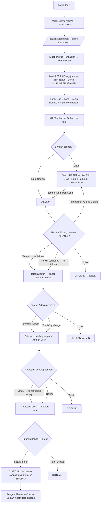

# WORKFLOW — Usulan Kebutuhan (`/usulan-kebutuhan`)

**Fungsi**: pengajuan usulan kebutuhan barang per sub-bidang → review bidang (opsional) → telaah Admin → putusan Kasubag → putusan final Kabag, plus rekap/export & pengaturan (pagu BLUD, batas waktu).
**Role**: semua role login bisa buka halaman; panel yang tampil per-role via `getPanels()` (`_utils.tsx`): SUB_BIDANG (18 role) = Buat/Usulan Saya/Lacak · BIDANG_* = Review Bidang/Data Review · ADMIN = Semua Usulan/Data Admin/Rekap/Pengaturan · ADMIN_KASUBAG & ADMIN_KABAG = Antrian Verif/Data Usulan/Rekap Verifikasi · SUPER_ADMIN = semua panel.
**File sumber**: `app/(dashboard)/usulan-kebutuhan/usulan-client.tsx` (shell + sidebar + notif), `_panels/` (15 panel), `_modals/` (Detail/Telaah/Putusan/Tahun/BidangReview), `_utils.tsx` (`getPanels`).

## Flowchart alur end-to-end

## Tabel langkah detail

| No | Halaman/URL | Tombol/elemen PERSIS | Aksi user | Hasil | Role |
|---|---|---|---|---|---|
| 1 | `/usulan-kebutuhan` | Sidebar grup **Pengajuan** → item **"Buat Usulan"** (`sb-sub-item`, usulan-client.tsx) | Klik | Panel `buat` (BuatPanel) terbuka; jika tahun belum dipilih, muncul TahunModal | SUB_BIDANG, SUPER_ADMIN |
| 2 | panel Buat | Modal pilih tahun → tombol **"Mulai Pengajuan"** (`TahunModal.tsx`) | Pilih Tahun Anggaran + Jenis (MURNI/PERUBAHAN), klik | Modal tertutup, form aktif, No. Usulan dipratinjau otomatis (`/api/usulan/preview-no`) | idem |
| 3 | panel Buat | Form **"📋 Informasi Pengajuan"**: select **"Sub Bidang / Bagian *"**, **"Jenis Belanja *"** (BuatPanel.tsx) | Pilih | Menentukan grouping usulan | idem |
| 4 | panel Buat | Card **"✏️ Input Item Barang"**: field **"Nama Barang *"**, **"Spesifikasi"**, **"Jumlah (Qty) *"**, **"Satuan *"**, **"Est. Harga Satuan (Rp) *"**, **"Prioritas"**, **"Alasan / Justifikasi"**, **"URL Merk 1-3"**, tombol upload **"📎 Pilih File"** | Isi item | Total Estimasi terhitung otomatis | idem |
| 5 | panel Buat | **"Tambah ke Daftar"** (`PrimaButton primary`, BuatPanel.tsx; jadi **"Update Item"** saat mode edit item) | Klik | Item masuk tabel daftar; di tabel ada ikon **"Edit"** & **"Hapus"** per baris (Tip label) | idem |
| 6 | panel Buat | **"Draft"** (`PrimaButton warning`) atau **"Kirim Usulan"** (`PrimaButton primary`) · **"Reset Semua"** (`ghost`, konfirmasi **"Ya, Reset"**) | Klik | POST `/api/usulan` — Draft tersimpan / langsung diajukan; redirect ke panel Usulan Saya + toast | idem |
| 7 | panel **Usulan Saya** (`milik`) | Toolbar: **"Refresh"**, **"Excel"**, **"PDF"** (DownloadButton), **"Kirim Semua (n)"** (`primary`), **"Baru"** (`purple`) (MilikPanel.tsx) | Klik | Kirim Semua → modal konfirmasi **"Ya, Kirim Sekarang"** (PUT `/api/usulan`) | SUB_BIDANG, SUPER_ADMIN |
| 8 | panel Usulan Saya | Row-action ikon (Tip label): **"Detail"** (Eye), **"Edit Draft"** (Edit3, hanya DRAFT), **"Kirim"** (Send, hanya DRAFT), **"Hapus"** (Trash, hanya DRAFT), **"Batalkan & kembalikan ke Draft"** (X, hanya DIAJUKAN_REVIEW) | Klik | Confirm dialog **"Ya, Lanjutkan"** lalu PATCH/DELETE `/api/usulan/[id]` | idem |
| 9 | panel **Review Bidang** (`bidang-antrian`) | Row-action **"Review"** (`btn btn-primary btn-sm`, BidangAntrianPanel.tsx) → modal **"🏢 Review Bidang"** | Pilih per item: **"✅ Setujui → ke Admin"** / **"✏️ Revisi Langsung → ke Admin"** / **"🔄 Kembalikan ke Sub Bidang"** / **"❌ Tolak"**, lalu submit | Usulan lanjut ke telaah Admin / kembali ke pengusul / ditolak | BIDANG_* (4 role), SUPER_ADMIN |
| 10 | panel **Semua Usulan** (`semua`) | Row-action **"Telaah"** (`btn btn-purple btn-sm`, SemuaPanel.tsx) → modal **"🔍 Telaah Usulan — Admin"** | Per item pilih **"✅ Setuju / Telaah"** / **"🔄 Revisi"** (isi Qty Revisi + Harga Revisi) / **"❌ Tolak"** → **"Simpan Telaah"** | Item DITELAAH/DIREVISI_ADMIN/DITOLAK_ADMIN; kelompok pindah ke panel Data Admin | ADMIN, SUPER_ADMIN |
| 11 | panel **Antrian Verif** (`antrian`) | Row-action **"Putusan"** (`btn btn-primary btn-sm`, AntrianPanel.tsx) → modal **"⚖️ Putusan ..."** | Kasubag per item: **"✅ Setuju → Teruskan ke Kabag"** / **"🔄 Revisi"** / **"❌ Tolak"**. Kabag group-level: **"✅ Setujui Final"** / **"❌ Tolak Semua"** → **"Simpan Putusan"** | Status DIPROSES → DISETUJUI/DITOLAK | ADMIN_KASUBAG, ADMIN_KABAG, SUPER_ADMIN |
| 12 | panel Antrian Verif | Toolbar bulk: **"Proses Semua → Kabag"** (Kasubag) / **"ACC Semua Final"** (Kabag) → modal konfirmasi **"📋 Ya, Proses Semua"** / **"✅ Ya, ACC Semua"** (usulan-client.tsx) | Klik | PUT `/api/usulan/putusan-bulk` — semua antrian diproses sekaligus (tidak bisa dibatalkan) | idem |
| 13 | panel **Lacak Usulan** (`tracking`) | Input **"Masukkan no. usulan atau nama barang..."** + tombol **"Lacak"** (TrackingPanel.tsx) | Ketik + Enter/klik | Tabel hasil + tombol Detail (Eye) | SUB_BIDANG, SUPER_ADMIN |
| 14 | modal **"📋 Detail Usulan"** | Tombol **"Kirim Ulang Revisi ke Bidang"** (DetailModal.tsx, muncul untuk pengusul saat item DIKEMBALIKAN) · **"Tutup"** | Edit spesifikasi/qty/harga lalu kirim ulang | Usulan kembali ke antrian review bidang | pengusul (creator) |
| 15 | panel **Kelola User** (`kelola-user`) | Search **"Cari username / nama / email..."** + dropdown role per user (KelolaUserPanel.tsx) | Ganti role | PATCH `/api/admin/users` action `ubah-role` — HANYA ubah role; aksi lain di `/admin` | ADMIN, SUPER_ADMIN |
| 16 | panel **Batas Waktu** | **"Simpan Konfigurasi"** (BatasWaktuPanel.tsx) | Set periode + pesan + aktif | Form Buat terkunci di luar periode | ADMIN, SUPER_ADMIN |
| 17 | panel **Set Pagu BLUD** | Input nominal + **"Simpan Pagu"** (SetPaguPanel.tsx) | Isi & simpan | Pagu untuk progress-bar KPI | ADMIN, SUPER_ADMIN |
| 18 | panel **Hapus Usulan** | **"Hapus Semua (n)"** (`danger`) / per-baris hapus → modal ketik **"HAPUS"** / **"HAPUS SEMUA"** → **"Hapus Permanen"** (HapusUsulanPanel.tsx) | Ketik teks konfirmasi persis | DELETE permanen (audit log) | SUPER_ADMIN (ADMIN juga punya panel per getPanels) |
| 19 | header | Lonceng notifikasi (`notif-btn`) → **"Tandai semua dibaca"** · UserBadge → **"Ganti Password"** / **"Keluar"** · tombol **"Menu"** (kembali ke `/menu`) | Klik | — | semua |

## Usulan anchor `data-rima` (BELUM dipasang — usulan)

| Anchor | Elemen | File |
|---|---|---|
| `usulan.sidebar-buat` | Sidebar item "Buat Usulan" | usulan-client.tsx |
| `usulan.tahun-mulai` | Tombol "Mulai Pengajuan" | _modals/TahunModal.tsx |
| `usulan.field-nama` | Input "Nama Barang *" | _panels/BuatPanel.tsx |
| `usulan.field-spesifikasi` | Input "Spesifikasi" | _panels/BuatPanel.tsx |
| `usulan.field-qty` | Input "Jumlah (Qty) *" | _panels/BuatPanel.tsx |
| `usulan.field-satuan` | Select "Satuan *" | _panels/BuatPanel.tsx |
| `usulan.field-harga` | Input "Est. Harga Satuan (Rp) *" | _panels/BuatPanel.tsx |
| `usulan.upload-file` | Tombol "📎 Pilih File" | _panels/BuatPanel.tsx |
| `usulan.tambah-item` | Tombol "Tambah ke Daftar" | _panels/BuatPanel.tsx |
| `usulan.preview-no` | Field readonly "No. Usulan" | _panels/BuatPanel.tsx |
| `usulan.btn-draft` | Tombol "Draft" | _panels/BuatPanel.tsx |
| `usulan.btn-ajukan` | Tombol "Kirim Usulan" | _panels/BuatPanel.tsx |
| `usulan.milik-kirim-semua` | Tombol "Kirim Semua (n)" | _panels/MilikPanel.tsx |
| `usulan.milik-baru` | Tombol "Baru" | _panels/MilikPanel.tsx |
| `usulan.milik-export-excel` | DownloadButton "Excel" | _panels/MilikPanel.tsx |
| `usulan.row-kirim` | Ikon Send (Tip "Kirim") di baris draft | _panels/MilikPanel.tsx |
| `usulan.row-edit-draft` | Ikon Edit3 (Tip "Edit Draft") | _panels/MilikPanel.tsx |
| `usulan.bidang-review` | Tombol "Review" di baris | _panels/BidangAntrianPanel.tsx |
| `usulan.btn-telaah` | Tombol "Telaah" di baris | _panels/SemuaPanel.tsx |
| `usulan.telaah-simpan` | Tombol "Simpan Telaah" | _modals/TelaahModal.tsx |
| `usulan.btn-putusan` | Tombol "Putusan" di baris | _panels/AntrianPanel.tsx |
| `usulan.putusan-simpan` | Tombol "Simpan Putusan" | _modals/PutusanModal.tsx |
| `usulan.bulk-acc` | Tombol "ACC Semua Final" / "Proses Semua → Kabag" | _panels/AntrianPanel.tsx |
| `usulan.tab-tracking` | Sidebar item "Lacak Usulan" | usulan-client.tsx |
| `usulan.tracking-cari` | Tombol "Lacak" | _panels/TrackingPanel.tsx |
| `usulan.notif-bell` | Tombol lonceng notifikasi | usulan-client.tsx |
| `usulan.set-pagu-simpan` | Tombol "Simpan Pagu" | _panels/SetPaguPanel.tsx |
| `usulan.batas-waktu-simpan` | Tombol "Simpan Konfigurasi" | _panels/BatasWaktuPanel.tsx |
| `usulan.hapus-semua` | Tombol "Hapus Semua (n)" | _panels/HapusUsulanPanel.tsx |

## Skenario tur yang disarankan

### Tur 1 — `usulan-buat-baru` (role SUB_BIDANG)
1. `usulan.sidebar-buat` — "Mulai dari sidebar grup Pengajuan → **Buat Usulan**."
2. `usulan.tahun-mulai` — "Pilih tahun anggaran & jenis (MURNI/PERUBAHAN), lalu **Mulai Pengajuan**."
3. `usulan.field-nama` → `usulan.field-qty` → `usulan.field-harga` — "Isi item; total dihitung otomatis."
4. `usulan.tambah-item` — "**Tambah ke Daftar** — bisa banyak item sekaligus."
5. `usulan.preview-no` — "Nomor usulan dipratinjau otomatis."
6. `usulan.btn-draft` / `usulan.btn-ajukan` — (Latihan: peringatan mutasi) "**Draft** untuk simpan dulu, **Kirim Usulan** untuk langsung diajukan."
7. `usulan.tab-tracking` — "Pantau status di **Lacak Usulan**: bidang → telaah Admin → Kasubag → Kabag."

### Tur 2 — `usulan-telaah` (role ADMIN)
1. Sidebar grup Admin → "Semua Usulan" → `usulan.btn-telaah` — "Klik **Telaah** di baris antrian."
2. Dalam modal: dropdown keputusan per item ("Setuju / Telaah" / "Revisi" / "Tolak"; Revisi wajib isi Qty & Harga Revisi).
3. `usulan.telaah-simpan` — "**Simpan Telaah** — kelompok pindah ke Data Admin & antri ke Kasubag."

### Tur 3 — `usulan-putusan` (role ADMIN_KASUBAG / ADMIN_KABAG)
1. Sidebar "Antrian Verif" → `usulan.btn-putusan` — "Klik **Putusan** per usulan."
2. Kasubag: per item "Setuju → Teruskan ke Kabag" / Kabag: group "Setujui Final" / "Tolak Semua".
3. `usulan.putusan-simpan` — peringatan mutasi.
4. `usulan.bulk-acc` — "Kalau antrian banyak dan sudah diperiksa, ada jalan cepat **ACC Semua Final** — hati-hati, tidak bisa dibatalkan."

> TODO screenshot: dashboard usulan, panel Buat Usulan (form + tabel item), modal Telaah, modal Putusan Kabag.
